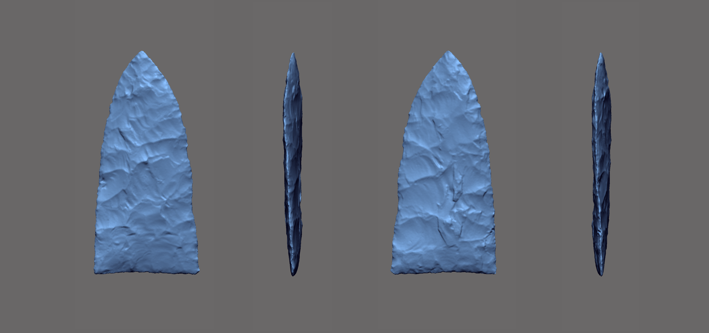
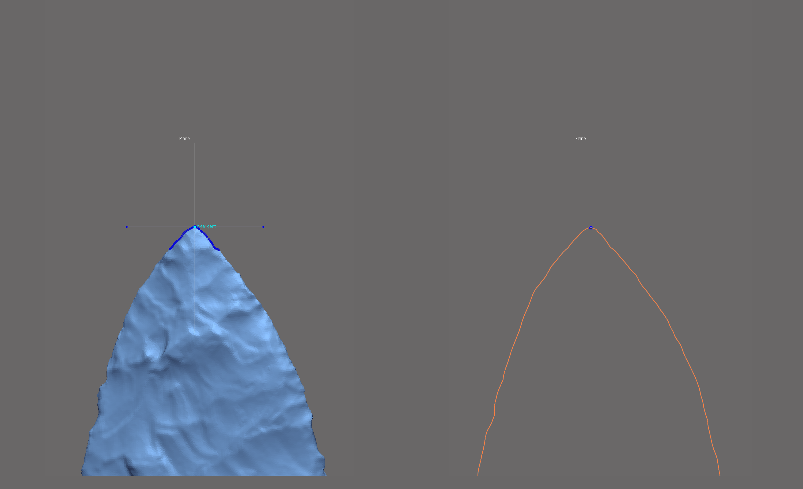
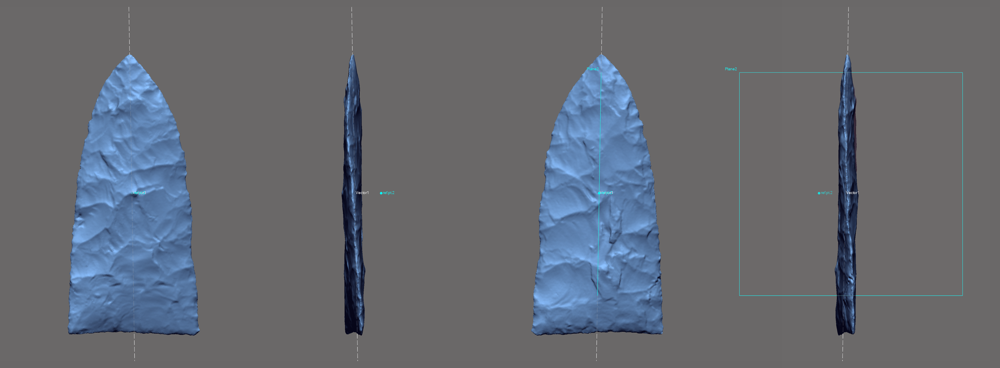
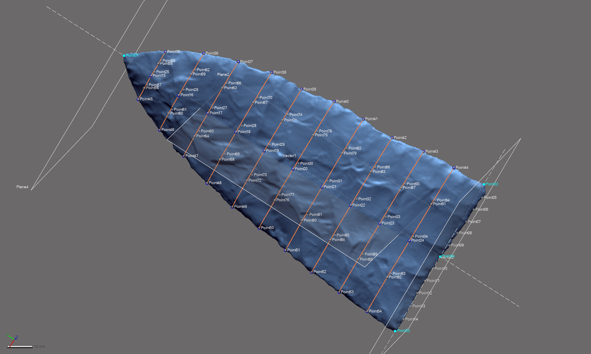

# Landmarking Protocol

The landmarking protocol developed for this project bears some visual similarities with the configuration used in the previous studies [@RN11783;@RN21001]. The first and most obvious difference is that this effort marks the continued evolution of the three-dimensional study. The second is the method of landmark placement, where _Geomagic Design X (Build Version 2020.0.1 [Build Number: 30])_ was used to modify the previous configuration, and to populate the landmarks and equidistant semilandmarks using mathematically-defined criteria that articulate with specific cross-sections and areas of interest.

```{r figbev, fig.cap="Gahagan biface 545 from the Gahagan Mound site, illustrating axial twisting."}

```

The goal of this effort was to increase the precsion and rigour of the study by including the z-dimension to capture those morphological characteristics associated with axial twisting that are introduced through the practice of bifacial beveling. This landmarking protocol represents an intermediate iteration between the previous 2D analysis [@RN11783], and the forthcoming protocol that also includes semilandmarks placed on a series of equidistant cross-sections. The cross-sections increase the coverage of semilandmarks across the mesh topology, and provide for greater precision in the analysis of morphology for the whole object. The evolution of this landmarking protocol represents a concerted effort to better comprehend the vagaries of morphological similarities and differences among Gahagan bifaces. While true that some landmarking protocols can be---and often are---recycled as new specimens are added, this particular research programme endeavours to achieve ever-greater accuracy and precision in each analytical iteration.

## Spline 1

A spline was extracted using the surface geometry of the mesh with the `extract contour curves` command that allows for the detection and extraction of 3D contour curves from high-curvature areas of the mesh. In reverse-engineering, `extract contour curves` is regularly employed as the first step in building the `patch network` used to build a surface. The extracted feature curve is rendered as a spline, and follows the highest curvature contours around the periphery of the lateral and basal edges, following the highly variable sinuous edge morphology around the entirety of the biface [@RN21001]. The remainder of the landmarking protocol is based upon this spline, which was subsequently split at four mathematically-defined locations [@RN21001].

```{r figspline, out.width = "100%", dpi = 300, echo=TRUE, warning=FALSE, fig.cap="Spline extracted along the highest contours of the projectile."}
knitr::include_graphics('images/extractspline.png')
```

### Splitting Spline 1

_A few definitions are warranted before proceeding. `Reference geometries` are used in the assistance of creating other features. These include basic geometric entities, such as `planes`, `vectors`, `coordinates`, `points`, and `polygons`. A `reference point` is a virtual point and is used to mark a specific position on a model or in 3D space. A `reference plane` is a virtual plane that has a normal direction and an infinite size. A `reference plane` is not a surface body, and is used to create other features._ 

The characteristic points and tangents developed for this landmarking protocol were inspired by the work of Birkhoff [-@RN11786]. The first landmark (LM1) is placed at the horizontal tangent on the tip of each Gahagan biface [@RN21001]. The second and third splits (LM2 and LM3) occur at points of highest curvature, and LM2 is always split on the right side of the biface when oriented in 3D space following the alignment output of _auto3dgm_ [@RN21001]. To place the final landmark (LM4), a linear measurement was used to project a reference point equidistant between LM2 and LM3. The location of that point was leveraged in placing the reference plane used to cut the spline at the location of LM4.

#### Split Spline 1 at location of LM1

The `horizontal tangent` is calculated by drawing a horizontal line above the tip of each biface using the tangent as a `common constraint`, and the horizontal as the `independent constraint`. To split the 3D spline at the location of the horizontal tangent, a `reference point` was inserted at the location of the `tangent` in the 2D sketch (light blue point; below, left), followed by a `reference plane` (in white; below, left and right) using the `pick point and normal axis` function where the `reference point` (h-tangent) was used as the `pick point`, and the `Right plane` as the `normal axis` (below, left). The 3D spline was then cut at the location where the `reference plane` intersected with the spline (below image, right).

```{r figlm1, out.width = "100%", dpi = 300, echo=TRUE, warning=FALSE, fig.cap="Identify horizontal tangent, insert reference point and reference plane (left). Use reference plane to cut spline at the location of the horizontal tangent (right)."}

```

#### Split Spline 1 at locations of LM2 and LM3

The point of highest curvature on either side of the basal edge was calculated using the `curvature function` in the Accuracy Analyser. This function displays the curvature flow as a continuous colour plot across the area of the curve. In this instance, _curvature_ is defined as the amount by which a geometric shape deviates from being flat or straight in the case of a line. The curvature is displayed in different colours according to the local radius, and is calculated in only one direction (U or V) along the curve. Using this tool, the two points of highest curvature were located between the basal and lateral edges on either side of each biface where the local radius measure was largest. The alignment and orientation of each biface was dictated by the _auto3dgm_ output (see Figure 7a in the manuscript), and the landmarking protocol follows the mesh orientation in that figure, where LM2 was always placed on the right side of the basal edge, and LM3 on the left.

```{r figcurve, out.width = "100%", dpi = 300, echo=TRUE, warning=FALSE, fig.cap="Identify points of hightest curvature (light blue) at left/right intersection of lateral and basal edges."}
knitr::include_graphics('images/splinesplit1.png')
```

#### Split Spline 1 at location of LM4

One additional landmark (LM4) was placed at the centre of the base. The location of this landmark was identified by calculating the linear distance between LM2 and LM3, and projecting a `reference point` (ctrl-div; below) equidistant between the two. A `reference plane` was added using the ctrl-div as the pick point, and the `Right plane` as the `normal axis`. The spline was then split at the intersection of the `reference plane` and the basal spline.

```{r figlm4, out.width = "100%", dpi = 300, echo=TRUE, warning=FALSE, fig.cap="Calculate linear distance between LM2 and LM3, insert reference plane coplanar to Right plane equidistant between LM2 and LM3, and use the reference plane to cut the spline."}
knitr::include_graphics('images/lm4.png')
```

## Spline sections

Each of the preceding protocols were used in the previous analysis of Gahagan bifaces [@RN21001], and this section represents an advancement over the previous landmarking strategy used to analyze the morphology of these important artifacts. The resulting constellation of landmarks and semilandmarks can be subset to test a wide range of hypotheses associated with the plan and profile views, in addition to cross sections. Each of the cross sections is split between LM 01 and LM04, allowing for analyses of bilateral asymmetry. 

### Refrence Vector 1, Point 2, and Plane 2

A linear reference vector (vector1) was inserted between LM 01 and LM 04, and a reference point (ref.pt.2) was placed equidistant between the two landmarks along vector1. The Z-coordinates of ref.pt.2 were altered to relocate it 15mm away from vector1 in the direction of the Z-axis. The `pick point and coplanar` function was then used to place a reference plane (Plane 2) along vector1 in the direction of ref.pt.2, bisecting the projectile point along the z-axis---perpendicular to the lateral edges---between LM 01 and LM 04.

```{r vecptplane, out.width = "100%", dpi = 300, echo=TRUE, warning=FALSE, fig.cap="Vector placed between LM 01 and 04, ref.pt.2 equidistant between the landmarks along the vector, then the Z-coordinates were altered to offset the point 15mm from the vector (left two images). The vector and ref.pt.2 were subsequently used to place a plane coplanar to the vector in the direction of ref.pt.2 using the `pick point and coplanar axis` function (right two images)."}

```

### Planes 3 and 4

Using the same method, a reference vector (vector2) was inserted between LMs 02 and 03, and a reference point (ref.pt.3) was placed equidistant between the two landmarks along vector 2. The Z-coordinates of ref.pt.3 were altered to relocate it 15 mm away from vector2 in the direction of the Z-axis. The `pick point and coplanar axis` function was then used to place a reference plane (Plane 3) along vector 2 in the direction of ref.pt.3, bisecting the projectile point along the X-axis---parallel to the base---between LM 02 and LM 03. A fourth plane (Plane 4) was subsequently inserted using the `pick point and normal axis` function that yielded a plane at the intersection of LM 01 and vector1. These two planes serve as the basis for the equidistant cross-sections.

```{r plane3.4, out.width = "100%", dpi = 300, echo=TRUE, warning=FALSE, fig.cap="Vector placed between LM 01 and 04, ref.pt.2 equidistant between the landmarks along the vector, then the Z-coordinates were altered to offset the point 15mm from the vector (left two images). The vector and ref.pt.3 were subsequently used to place a plane coplanar to the vector in the direction of ref.pt.3 using the `pick point and coplanar axis` function. Plane 4 was inserted using the `pick point and normal axis` function with vector1 as the normal axis, and LM 01 as the pick point."}
knitr::include_graphics('images/plane3-4.png')
```

### Cross-sections

Ten equidistant cross-sections were then inserted between the references planes (Planes 3 and 4). These cross sections will be split at the points of highest curvature on the lateral edges, and along the mid-line of the point where they intersect with Plane 2.

```{r cross.10, out.width = "100%", dpi = 300, echo=TRUE, warning=FALSE, fig.cap="Ten equidistant cross-sections were inserted between Plane 3 and Plane 4."}
knitr::include_graphics('images/cross.10.png')
```

#### Splitting Cross-sections (Step 1)

Cross-sections were then split at the intersection of the splines and Plane 2. The resulting reference geometry not only provides a means of analyzing the contribution of the morhpology associated with the projectile's profile, but also divides the landmarking configuration into two discrete components (L/R) that can be used in subsequent analyses of bilateral asymmetry.

```{r cut.cross.plane2, out.width = "100%", dpi = 300, echo=TRUE, warning=FALSE, fig.cap="Cross-sections were cut where they intersect with Plane 2, along the mid-line of the projectile between LM 01 and LM 04."}
knitr::include_graphics('images/cut.cross.plane2.png')
```

#### Splitting Cross-sections (Step 2)

Cross sections were then split at the points of highest curvature along the lateral edges of the projectile. These semilandmarks contribute to the analysis of the projectile in plan view, but also follows the dynamic 3D contours associated with the sinuous edge.

```{r pt.high.curv.split, out.width = "100%", dpi = 300, echo=TRUE, warning=FALSE, fig.cap="Spline splits along the lateral edges occur at the point of highest curvature."}
knitr::include_graphics('images/pt.high.curv.split.png')
```

## Landmark and semilandmark placement

LM 01-04 were placed at the locations of spline splits following the same protocol enlisted by the previous study (blue points, below) [@RN21001]. Five
equidistant semilandmarks were added between LM 02 and LM 04, and between LM 04 and LM 03. Semilandmarks were numbered from top to bottom along front and back of the mid-line, then from top to bottom along the right and left lateral edges (alignment dictated by _auto3dgm_). One additional semilandmark was placed equidistant between the lateral edge and mid-line on each remaining spline. 

```{r figlmslm-all, out.width = "100%", dpi = 300, echo=TRUE, warning=FALSE, fig.cap="Reference geometry and 3D splines with landmarks (blue) and semilandmarks (white) applied."}

```

The resulting constellation of landmarks and semilandmarks can be parsed and divided to answer wide-ranging morphological questions related to Gahagan bifaces, and marks a substantial advancement in the analysis of Gahagan biface morphology.

## Acknowledgments

I extend my gratitude to Christian S. Hoggard and David K. Thulman for their thoughtful comments and constructive criticisms on an earlier draft of this landmarking protocol. The current iteration of the landmarking protocol was developed using the `digit3DLand` package in R (code available in this repository); however, the capacity to populate a replicable suite of reference geometry across the sample in _Geomagic Design X_ made it a better option for the dynamic design process. Definitions of reference geometries and _Design X_ features described in this protocol are paraphrased from the reference manual.
