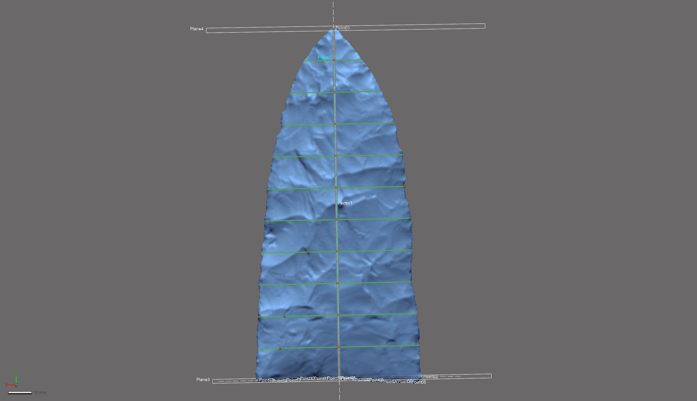

# Landmarking Protocol 3d2

The landmarking protocol developed for this project represents a substantial methodological advancement when contrasted with those protocols used in previous studies of Gahagan biface morphology [@RN11783;@RN21001]. This protocol represents the continued evolution of a research programme concerned with the development of a rigorous and replicable three-dimensional (3D) landmarking workflow, which simultaneously takes into account the unique and complex design elements associated with individual bifaces. Landmark (LM) and semilandmark (sLM) placement was achieved through the construction of reference geometry in _Geomagic Design X (Build Version 2020.0.2 [Build Number: 55])_, used to expand upon the previous LM configuration, and capitalise upon additional design attributes. Reference geometry provides the requisite foundation needed to apply the LM and sLM points at mathematically-defined locations. The result is a LM and sLM configuration that articulates with specific morphological features (plan views, profiles, and cross-sections), which have demonstrated utility in wide-ranging studies of biface and projectile point morphology.

## Foundations

The initial landmarking protocol enlisted a curve that was projected onto a 2D plane. That protocol provided the framework needed to begin a more thorough considertion of 3D landmarking protocols, driving the evolution of the landmarking protocol described here.

```{r fig.gahaganmorph, fig.cap="The landmarking protocol used in the 2D analysis of Gahagan bifaces, where all landmarks and semilandmarks were projected onto a plane."}
knitr::include_graphics('images/gahaganmorph.jpg')
```

The first 3D landmarking protocol ([LM3d1](https://github.com/aksel-blaise/gahaganmorph2/blob/master/analysis/landmarking-protocol.md)) used for an analysis of Gahagan bifaces was focused only upon the plan view (lateral edges), and _auto3dgm_ was used to achieve the principal alignments needed to assign sides (front/back) to each face. While basic, this landmarking protocol generated the framework needed to begin constructing suites of reference geometry that can be tailored to address specific, and pointed, research questions.

```{r fig.gahaganmorph2, fig.cap="The first [3D landmarking protocol](https://github.com/aksel-blaise/gahaganmorph2/blob/master/analysis/landmarking-protocol.md) (LM3d1) used to analyse Gahagan bifaces, which captured those attributes associated with axial twisting."}
knitr::include_graphics('images/gahaganmorph2.png')
```

The goal of this effort was to increase the precision and rigour of the study by including additional elements from the Z-dimension to capture those morphological characteristics associated with plan, profile, and cross-sections. This landmarking protocol is the culmination of the iterative design process that began during the previous 2D [@RN11783] and 3D ([LM3d1](https://github.com/aksel-blaise/gahaganmorph2/blob/master/analysis/landmarking-protocol.md)) [@RN21001] geometric morphometric analyses. The cross-sections increase the coverage of sLMs across mesh topology, providing for greater precision in the analysis of whole-object morphology, and can be subset as a means of analysing specific features of interest. For this study, the previously-noted morphological differences that occur in plan view [@RN11783;@RN21001] are further scrutinised in an effort to explore whether those differences in Gahagan biface plan view might be said to extend to the profiles of Gahagan bifaces. Due to the degree of axial twisting that occurs across the sample, it is not possible to gather the data needed to answer this query using 2D methods.

The continued evolution of this landmarking protocol represents a concerted effort to better comprehend the vagaries of morphological similarities and differences among Gahagan bifaces. While true that some landmarking protocols can be---and often are---recycled as new specimens are added, this particular research programme endeavours to achieve ever-greater accuracy and precision in each subsequent iteration.

## Spline 1

A spline was extracted to follow the surface geometry of the mesh with the `extract contour curves` command that allows for detection and extraction of 3D contour curves from high-curvature areas (lateral/basal edges). In reverse-engineering, `extract contour curves` is regularly employed as the first step in building a `patch network` to construct a surface. The extracted feature curve is rendered as a spline, and follows the highest curvature contours around the periphery of the lateral and basal edges, following the sinuous and highly variable edge morphology around the entirety of each biface [@RN21001]. The remainder of the landmarking protocol is based upon this spline, which was subsequently split at four mathematically-defined locations [@RN21001].

```{r figspline, out.width = "100%", dpi = 300, echo=TRUE, warning=FALSE, fig.cap="Spline extracted along the highest contours of the projectile."}
knitr::include_graphics('images/extractspline.png')
```

### Splitting Spline 1

_A few definitions are warranted before proceeding. `Reference geometries` are used in the assistance of creating other features. These include basic geometric entities, such as `planes`, `vectors`, `coordinates`, `points`, and `polygons`. A `reference point` is a virtual point and is used to mark a specific position on a model or in 3D space. A `reference plane` is a virtual plane that has a normal direction and an infinite size. A `reference plane` is not a surface body, and is used to create other features._ 

The characteristic points and tangents developed for this landmarking protocol were inspired by the work of Birkhoff [-@RN11786]. The first landmark (LM 01) is placed at the horizontal tangent on the tip of each Gahagan biface [@RN21001]. The second and third splits (LM 02 and LM 03) occur at points of highest curvature, and LM 02 is always placed on the right side of the biface when oriented in 3D space following the alignment output of _auto3dgm_ [@RN21001]. To place the final landmark (LM 04), a linear measurement was used to project a reference point equidistant between LM 02 and LM 03 [@RN21001]. The location of that point was leveraged in placing the reference plane used to cut the spline at the location of LM 04 [@RN21001].

#### Split Spline 1 at location of LM 01

The `horizontal tangent` is calculated by drawing a horizontal line above the tip of each biface using the tangent as a `common constraint`, and the horizontal as the `independent constraint`. To split the 3D spline at the location of the horizontal tangent, a `reference point` was inserted at the location of the `tangent` in the 2D sketch (light blue point; below, left), followed by a `reference plane` (in white; below, left and right) using the `pick point and normal axis` function where the `reference point` (h-tangent) was used as the `pick point`, and the `Right plane` as the `normal axis` (below, left). The 3D spline was cut at the location where the `reference plane` intersected with the spline (below image, right).

```{r figlm1, out.width = "100%", dpi = 300, echo=TRUE, warning=FALSE, fig.cap="Identify horizontal tangent, insert reference point and reference plane (left). Use reference plane to cut spline at the location of the horizontal tangent (right)."}
knitr::include_graphics('images/lm1.png')
```

#### Split Spline 1 at locations of LM 02 and LM 03

The point of highest curvature on either side of the basal edge was calculated using the `curvature` function in the Accuracy Analyser. This function displays the curvature flow as a continuous colour plot across the area of the curve. In this instance, _curvature_ is defined as the amount by which a geometric shape deviates from being flat or straight in the case of a line. Curvature is displayed in different colours according to the local radius, and is calculated in only one direction (U or V) along the curve. Using this tool, the two points of highest curvature were located between the basal and lateral edges on either side of each biface where the local radius measure was largest. The alignment and orientation of each biface was dictated by the _auto3dgm_ output, and the landmarking protocol follows the mesh orientation, where LM 02 was always placed on the right side of the basal edge, and LM03 on the left.

```{r figcurve, out.width = "100%", dpi = 300, echo=TRUE, warning=FALSE, fig.cap="Identify points of hightest curvature (light blue) at left/right intersection of lateral and basal edges."}
knitr::include_graphics('images/splinesplit1.png')
```

#### Split Spline 1 at location of LM 04

One additional landmark (LM 04) was placed at the centre of the base. The location of this LM was identified by calculating the linear distance between LM2 and LM3, and projecting a `reference point` (ctrl-div; below) equidistant between the two. A `reference plane` was added using the ctrl-div as the pick point, and the `Right plane` as the `normal axis`. The spline was then split at the intersection of the `reference plane` and the basal spline.

```{r figlm4, out.width = "100%", dpi = 300, echo=TRUE, warning=FALSE, fig.cap="Calculate linear distance between LM2 and LM3, insert reference plane coplanar to Right plane equidistant between LM2 and LM3, and use the reference plane to cut the spline."}
knitr::include_graphics('images/lm4.png')
```

## New reference geometry

Each of the preceding protocols were used in the previous analysis of Gahagan bifaces [@RN21001], and the following sections detail the logical evolution of the previous landmarking protocol. The resulting constellation of LM and sLM points can be subset to test a wide range of hypotheses associated with the plan and profile views of bifaces, and can be extended to include specific or multiple cross-sections. Each cross-section is also split between LM 01 and LM04, allowing for analyses of bilateral asymmetry. 

### Vector 1, Point 2, and Plane 2

A linear `reference vector` (vector1) was inserted between LM 01 and LM 04, and a `reference point` (ref.pt.2) placed equidistant between the two landmarks along vector1. The Z-coordinates of ref.pt.2 were altered to relocate it 15mm from vector1 in the direction of the Z-axis, while otherwise maintaining its' alignment with vector 1. The `pick point and coplanar` function was used to place a `reference plane` (Plane 2) along vector1 in the direction of ref.pt.2, bisecting the biface along the Z-axis---perpendicular to the lateral edges---between LM 01 and LM 04.

```{r vecptplane, out.width = "100%", dpi = 300, echo=TRUE, warning=FALSE, fig.cap="Vector placed between LM 01 and 04, ref.pt.2 equidistant between the landmarks along the vector, then the Z-coordinates were altered to offset the point 15mm from the vector (left two images). The vector and ref.pt.2 were subsequently used to place a plane coplanar to the vector in the direction of ref.pt.2 using the `pick point and coplanar axis` function (right two images)."}
knitr::include_graphics('images/vecptplane.png')
```

### Planes 3 and 4

Using the same method, a `reference vector` (vector2) was inserted between LM 02 and LM 03, and a `reference point` (ref.pt.3) was placed equidistant between the two LMs along vector 2. The Z-coordinates of ref.pt.3 were similarly altered to relocate it 15 mm from vector2 in the direction of the Z-axis. The `pick point and coplanar axis` function was used to place a `reference plane` (Plane 3) along vector 2 in the direction of ref.pt.3, bisecting the biface along the X-axis---parallel to the base---between LM 02 and LM 03. A fourth `reference plane` (Plane 4) was subsequently inserted using the `pick point and normal axis` function that yielded a plane at the intersection of LM 01 and vector1. These two planes serve as the basis for the equidistant cross-sections.

```{r plane3.4, out.width = "100%", dpi = 300, echo=TRUE, warning=FALSE, fig.cap="Vector placed between LM 01 and 04, ref.pt.2 equidistant between the landmarks along the vector, then the Z-coordinates were altered to offset the point 15mm from the vector (left two images). The vector and ref.pt.3 were subsequently used to place a plane coplanar to the vector in the direction of ref.pt.3 using the `pick point and coplanar axis` function. Plane 4 was inserted using the `pick point and normal axis` function with vector1 as the normal axis, and LM 01 as the pick point."}
knitr::include_graphics('images/plane3-4.png')
```

## Cross-sections

Ten equidistant cross-sections were inserted between the `reference planes` (Planes 3 and 4) using the `section` function. The resulting curves were split at the points of highest curvature along the lateral edges, then along the mid-line at the point where they intersect with Plane 2.

```{r cross.10, out.width = "100%", dpi = 300, echo=TRUE, warning=FALSE, fig.cap="Ten equidistant cross-sections were inserted between Plane 3 and Plane 4."}
knitr::include_graphics('images/cross.10.png')
```

### Splitting cross-sections (Step 1)

Cross-sections were split at the intersection of each horizontal curve and `reference plane` 2 (ref.pl.2). The resulting `reference geometry` provides a means of analysing the contribution of the morphology associated with the projectile's profile, and divides the landmarking configuration into two discrete components (plan and profile view) that can be used in the subsequent analysis.

```{r cut.cross.plane2, out.width = "100%", dpi = 300, echo=TRUE, warning=FALSE, fig.cap="Cross-sections were cut where they intersect with Plane 2, along the mid-line of the projectile between LM 01 and LM 04."}

```

### Splitting cross-sections (Step 2)

Cross sections were then split at points of highest curvature along the lateral edges of the projectile. These sLMs contribute to the analysis of the projectile in plan view, and follow the dynamic---and unique---3D contours associated with the sinuous edge of each biface.

```{r pt.high.curv.split, out.width = "100%", dpi = 300, echo=TRUE, warning=FALSE, fig.cap="Spline splits (blue dots) along the lateral edges occur at the point of highest curvature. These splits occur at known coordinates used to add the semilandmarks."}
knitr::include_graphics('images/pt.high.curv.split.png')
```

## Landmark and semilandmark placement

LMs 01-04 were placed at the locations of spline splits following the same protocol enlisted by the previous study (blue points, below) [@RN21001]. Two equidistant sLMs were added between LM 02 and LM 04, and between LM 04 and LM 03. Along the mid-line, sLMs were numbered from top to bottom along the right and left lateral edges, then from top to bottom along mid-line of the biface, using the principal alignment output dictated by _auto3dgm_.

```{r figlmslm-all, out.width = "100%", dpi = 300, echo=TRUE, warning=FALSE, fig.cap="Reference geometry and 3D curves with landmarks (blue) and semilandmarks (white) applied."}

```

The resulting constellation of LMs and sLMs can be parsed and divided to answer wide-ranging morphological questions related to Gahagan bifaces, marking a substantive advancement in the analysis of Gahagan biface morphology. The design of the `reference geometry` used in LM3d2 is extensible, and the semilandmark configuration can expanded or contracted depending upon the research question.

## Acknowledgments

I extend my gratitude to Christian S. Hoggard and David K. Thulman for their thoughtful comments and constructive criticisms on an earlier draft of ([LM3d1](https://github.com/aksel-blaise/gahaganmorph2/blob/master/analysis/landmarking-protocol.md), and this landmarking protocol. The current iteration of the landmarking protocol was developed using the `digit3DLand` package in R (code available in this repository); however, the capacity to populate a replicable suite of `reference geometry` across the sample in _Geomagic Design X_ provides a means of making this design process extensible.
