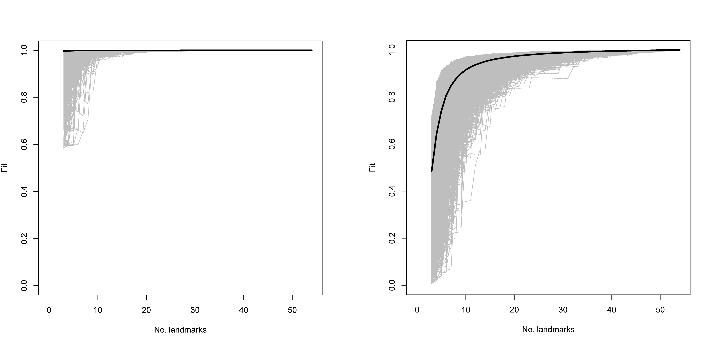

# Landmark Sampling Evaluation Curve (LaSEC)

The two previous, and current, landmarking configurations used to analyse Gahagan bifaces were further scrutinised using the Landmark Sampling Error Curve, or `LaSEC`, that is included in the `LaMBDA` package, as a means of assessing the fidelity of morphological characterisation by landmarks [@RN28913].

LaSEC conducts the following procedure [@RN28913, 4-5]:

1. As is typical for extracting shape data, perform a generalized Procrustes alignment (`gpagen` function in the `geomorph` package) on a coordinate dataset (argument `coord.data`) in 2-D or 3-D (argument `n.dim`) and record the resulting shape coordinates and centroid size. Here, the shape coordinates are projected onto tangent space because pairwise distances among corresponding datasets later in the analysis are based on Euclidean distances and most shape analyses in the biological literature are conducted in tangent space instead of Procrustes shape space.
2. Subsample the same three randomly selected landmarks from all specimens. The subsampling begins with a subset of three landmarks because a minimum of three landmarks is required to define shape. Then, generate shape and centroid size data with generalized Procrustes superimposition on the subsampled data.
3. Perform an Ordinary Procrustes Alignment (`protest` function in the `vegan` R package) on the subsampled data to minimize the pairwise distances between corresponding landmarks in the parent data through translation, rotation, and scaling of data in full shape space. As stated above, note that this procedure is different from the typical implementation of Procrustes alignment on coordinate data in 2-D or 3-D space. The function then records the sum of these squared distances as measure of fit (PSS) between the relative locations of data points in the parent and subsampled datasets. Equivalent procedure is conducted on centroid size data.
4. Sample one additional, randomly chosen landmark and repeat step 3 until the entire set of landmarks in the parent dataset is sampled. The completion of this step represents one iteration of subsampling.
5. Repeat steps 2–5 for specified number of iterations (`iter` argument).
6. Create sampling curves by plotting the trajectory of “fit” (1–PSS) against the number of landmarks sampled from each iteration for both shape and centroid size as gray lines. Then, plot the median fit value for each number of landmarks sampled on the same plot as a thick, dark line. Finally, output these sampling curves: `LaSEC_SamplingCurve_Shape.pdf`, `LaSEC_SamplingCurve_Size.pdf`.

## Current 3D iteration (LM3d2)

In the initial 3D configuration [@RN21001] was applied following alignment in `auto3dgm`, was originally designed using the R package `digit3DLand`, prior to migrating the protocol to _Geomagic Design X_. During the previous analysis, it was noted that some of the Gahagan bifaces evidenced axial twisting, which was more apparent in the sample from central Texas. In order to capitalise on this dynamic edge morphology, a new 3D [landmarking protocol](https://github.com/aksel-blaise/gahaganmorph2/blob/master/analysis/landmarking-protocol.md) was developed that enlisted four landmarks, and 50 semilandmarks. Like the 2D landmarking protocol that preceded it, this 3D landmarking protocol was based upon the placement of specific elements of reference geometry.

```{r fig.gahaganmorph2.xr2, fig.cap="The first [3D landmarking protocol](https://github.com/aksel-blaise/gahaganmorph2/blob/master/analysis/landmarking-protocol.md) (LM3d1) used to analyse Gahagan bifaces, which captured those attributes associated with axial twisting."}
knitr::include_graphics('images/gahaganmorph2.png')
```

```{r, load.lasec.package.3d1, echo=TRUE, eval=FALSE}
# read .csv files
setwd("./data")
filelist <- list.files(pattern = ".csv")
lmdata.3d1 <- readmulti.csv(filelist)
lmdata.3d1 <- two.d.array(lmdata.3d1)
setwd("../")

# analysis
lasec(coord.data = lmdata.3d1, n.dim = 3, iter = 1000)
```

Results demonstrate that 10 landmarks are necessary to achieve a median fit value of 0.90, 14 to achieve a median fit value of 0.95, and 33 to achieve a fit value of 0.99. For centroid size, only three landmarks are needed to achieve a median fit value of 0.99. 

```{r fig.lasec.3d1, fig.cap="Sampling curves from performing `LaSEC` on the initial 3D dataset with respect to characterising shape variation. Each gray line indicates fit values from one iteration of subsampling. Thick, dark line denotes median fit value at each number of landmarks. `LaSEC` sampling curve for shape (left), and for centroid size (right).. Results produced using the code above for this 3D dataset, using 1,000 iterations. Images converted to PNG following export."}

```

Results demonstrate saltation, illustrating that some landmarks are critical for capturing shape information [@RN28913]. Dynamic as the Gahagan bifaces may be in shape, the variation in shape might have been captured with a landmarking protocol that employed fewer equidistant semilandmarks along the edges and base. 

## Acknowledgments

I extend my gratitude to Akinobu Watanabe for guidance related to the evaluation of these landmarking protocols.