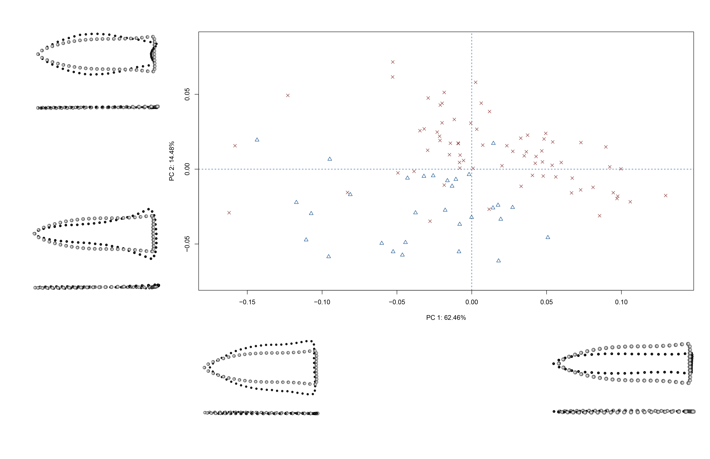
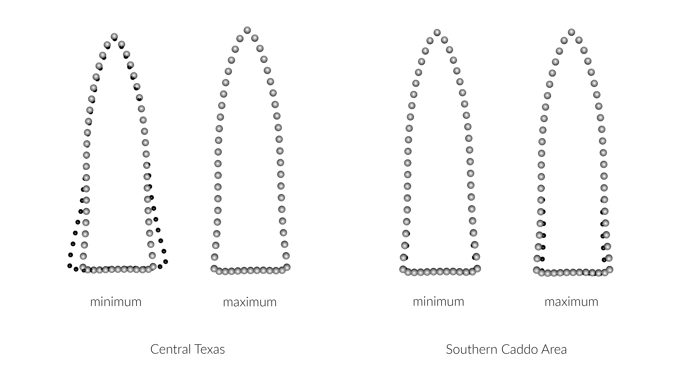
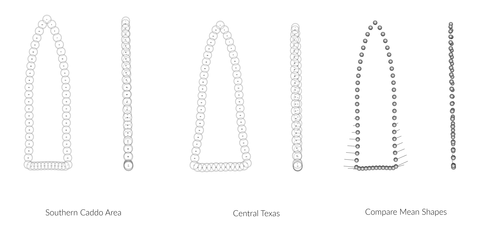

# Geometric morphometrics

This effort follows recent analyses of Gahagan biface shapes across the southern Caddo area and central Texas [@RN11783;@RN21001], where Gahgagan bifaces were found to differ in shape across the same geography as the Smithport Plain and Hickory Engraved bottles [@RN11801;@RN11782;@RN11716;@RN20852]. The analysis builds upon previous discussions and analyses conducted by Shafer [-@RN3684;-@RN20701;-@RN4924]. A succinct overview of the analytical procedures used in the analysis is provided in the manuscript, and the analytical code provided in this document can be used to reproduce the results exactly.

```{r gahagan bifaces 2D, out.width = "100%", dpi = 300, echo=TRUE, warning=FALSE, fig.cap="Gahagan bifaces from the southern Caddo area (SCA) and central Texas region."}
knitr::include_graphics('images/figure02.jpg')
```

## Load geomorph and data

```{r load geomorph, setwd, and load data, echo=TRUE}
# load geomorph
devtools::install_github("geomorphR/geomorph", ref = "Stable", build_vignettes = TRUE)
library(geomorph)
library(wesanderson)

# set working directory
setwd(getwd())
source('readmulti.csv.R')

# read .csv files
setwd("./data")
filelist <- list.files(pattern = ".csv")
coords <- readmulti.csv(filelist)
setwd("../")

# read qualitative data
qdata<-read.csv("qdata.csv",header=TRUE, row.names=1)
qdata<-qdata[match(dimnames(coords)[[3]],rownames(qdata)),]
qdata
```

## Generalised Procrustes Analysis

```{r gpa, out.width = "100%", dpi = 300, echo=TRUE, warning=FALSE}
Y.gpa<-gpagen(coords, PrinAxes = TRUE, print.progress = FALSE)
# plot(Y.gpa)
# geomorph data frame
gdf<-geomorph.data.frame(shape=Y.gpa$coords, size=Y.gpa$Csize, region=qdata$region, region2=qdata$region2) 
csz<-Y.gpa$Csize # attribute for boxplot
rgn2<-qdata$region2 # attribute for boxplot
# boxplot of SCA-north, SCA-south, and central Texas Gahagan bifaces by centroid size
boxplot(csz~rgn2, 
        main = "Centroid size of Gahagan bifaces by Region 2",
        names = c("CTX", "SCA-north", "SCA-south"),
        xlab = "Region",
        ylab = "Centroid Size",
        col = wes_palette("Moonrise2"),
        )
# plot consensus configuration in 2D to illustrate axial twisting
par(mfrow=c(1,3))
plot(Y.gpa$consensus[,c("Y", "X")], pch=20)
plot(Y.gpa$consensus[,c("Z", "X")], pch=20)
plot(Y.gpa$consensus[,c("Z", "Y")], pch=20)
# 3D GPA plot
knitr::include_graphics('images/gpa3d.png')
fig.cap="Results of generalized Procrustes analysis."
```

## Principal Components Analysis

```{r pca, out.width = "100%", dpi = 300, echo=TRUE, warning=FALSE, fig.cap="Results of PCA with central Texas sample in blue triangles, and southern Caddo area in red X's. Reference shapes include the consensus configuration (gray) and the shape at the extreme of each PC in black. Reference shapes do not articulate with any specimens used in this analysis."}
# principal components analysis
pca<-gm.prcomp(Y.gpa$coords)
summary(pca)

# set plot parameters to plot by region2
reg2 <- qdata$region2
pch.gps.reg2 <- c(15,17,19)[as.factor(reg2)]
col.gps.reg2 <- wes_palette("Moonrise2")[as.factor(reg2)]
col.hull <- c("#798E87","#C27D38","#CCC591")

# plot pca by incision profile
pc.plot1 <- plot(pca, asp = 1,
                  pch = pch.gps.reg2,
                  col = col.gps.reg2)
                  shapeHulls(pc.plot1, 
                             groups = reg2,
                             group.cols = col.hull)
                  
# plot PCA with warp grids
#PCAplot<-plot(PCA, col = colors, pch = shapes)
#
```

## Define models

```{r define-models}
# allometry
fit.size <- procD.lm(shape ~ size, data = gdf, print.progress = FALSE, iter = 9999)
# allometry - common allometry, different means -> reg2
fit.sz.reg <- procD.lm(shape ~ size + reg2, data = gdf, print.progress = FALSE, iter = 9999)
# allometry - unique allometries -> reg2
fit.sz.reg2 <- procD.lm(shape ~ size * reg2, data = gdf, print.progress = FALSE, iter = 9999)

# size as a function of group
fit.sizereg2 <- procD.lm(size ~ reg2, data = gdf, print.progress = FALSE, iter = 9999)

# shape as a function of group
fit.shapereg2 <- procD.lm(shape ~ reg2, data = gdf, print.progress = FALSE, iter = 9999)
```

## Allometry

```{r allometry, out.width = "100%", dpi = 300, echo=TRUE, warning=FALSE}
# allometry - does shape change with size?
anova(fit.size)

# reg2
anova(fit.sz.reg) # common allometry (reg2)
anova(fit.sz.reg2) # unique allometry (reg2)
anova(fit.sz.reg2, fit.sz.reg2, print.progress = FALSE)

# allometry plots
# regscore (Drake and Klingenberg 2008)
plot(fit.size, type = "regression", reg.type = "RegScore", predictor = log(gdf$size), pch = pch.gps.reg2, col = col.gps.reg2)

# common allometric component (Mitteroecker 2004)
plotAllometry(fit.sz.reg, size = gdf$size, logsz = TRUE, method = "CAC", pch = pch.gps.reg2, col = col.gps.reg2)

# size-shape pca (Mitteroecker 2004)
plotAllometry(fit.size, size = gdf$size, logsz = TRUE, method = "size.shape", pch = pch.gps.reg2, col = col.gps.reg2)

# predline (Adams and Nistri 2010)
plotAllometry(fit.sz.reg2, size = gdf$size, logsz = TRUE, method = "PredLine", pch = pch.gps.reg2, col = col.gps.reg2)

# plot form
#
#fig.cap="Measures of Gahagan biface morphology as a function of size for bifaces from both regions, where small and large specimens from each region (black spheres) are contrasted with the consensus configuration (gray spheres)."
```

## Size/Shape ~ Region?

```{r region}
# ANOVA: do gahagan biface shapes differ by region2?
anova(fit.shapereg2)
# pairwise comparison of LS means = which differ?
sh.reg2 <- pairwise(fit.shapereg2, groups = qdata$region2)
summary(sh.reg2, confidence = 0.95, test.type = "dist")
# pairwise distance between variances = standardization?
summary(sh.reg2, confidence = 0.95, test.type = "var")

# ANOVA: do incision sizes differ (inc2)?
anova(fit.sizereg2)
# pairwise comparison of LS means = which differ?
sz.reg2 <- pairwise(fit.sizereg2, groups = qdata$region2)
summary(sz.reg2, confidence = 0.95, test.type = "dist")
# pairwise distance between variances = standardization?
summary(sz.reg2, confidence = 0.95, test.type = "var")
```

## Morphological disparity

```{r m-disparity, out.width = "100%", dpi = 300, echo=TRUE, warning=FALSE}
# morphological disparity: do either of the groups display greater shape variation among individuals relative to the other group?
morphol.disparity(fit.shapereg2, groups = qdata$region2, data = gdf, print.progress = FALSE, iter = 9999)
# morphological disparity: do either of the groups display greater size variation among individuals relative to the other group?
morphol.disparity(fit.sizereg2, groups = qdata$region2, data = gdf, print.progress = FALSE, iter = 9999)
```

## Mean shapes

```{r m-shapes, out.width = "100%", dpi = 300, echo=TRUE, warning=FALSE}
#subset landmark coordinates to produce mean shapes for groups
new.coords<-coords.subset(A = Y.gpa$coords, group = qdata$region2)
names(new.coords)
#group shape means
mean<-lapply(new.coords, mshape)
# plot(mean$CTX)
# plot(mean$SCA)
# plotRefToTarget(mean$SCA,mean$CTX, method="vector",mag=2)
# 
# fig.cap="Mean shapes for Gahagan bifaces from the southern Caddo area (left) and central Texas region (center). In the comparison of the two (right), the southern Caddo area is represented by gray spheres, and the central Texas region by linear vectors."
```

## Acknowledgments

I extend my gratitude to the Caddo Tribe of Oklahoma, the Williamson Museum at Northwestern State University, the Louisiana State Exhibit Museum, the Texas Archeological Research Laboratory at The University of Texas at Austin, the Brazos Valley Museum of Natural History, the Texas Parks and Wildlife Department, and the Sam Noble Oklahoma Museum of Natural Science for the requisite permissions and access needed to generate the scans of Gahagan bifaces. Thanks to Harry J. Shafer, Jeffrey S. Girard, Hiram F. (Pete) Gregory, Julian A. Sitters, Timothy K. Perttula, and David K. Thulman for their comments on a draft of this manuscript. Thanks also to Dean C. Adams, Michael L. Collyer, Emma Sherratt, Lauren Butaric, and Kersten Bergstrom for their constructive criticisms, comments, and suggestions throughout the development of this research programme, and to the editors and anonymous reviewers for their comments and constructive criticisms, which further improved the manuscript.

Components of this analytical work flow were developed and funded by a Preservation Technology and Training grant (P14AP00138) to RZS from the National Center for Preservation Technology and Training, and funding to scan the Gahagan bifaces at the Williamson Museum at Northwestern State University, Louisiana State Exhibit Museum, Texas Archeological Research Laboratory at The University of Texas at Austin, and Sam Noble Oklahoma Museum of Natural Science was provided to RZS by the Heritage Research Center at Stephen F. Austin State University.

## References cited
