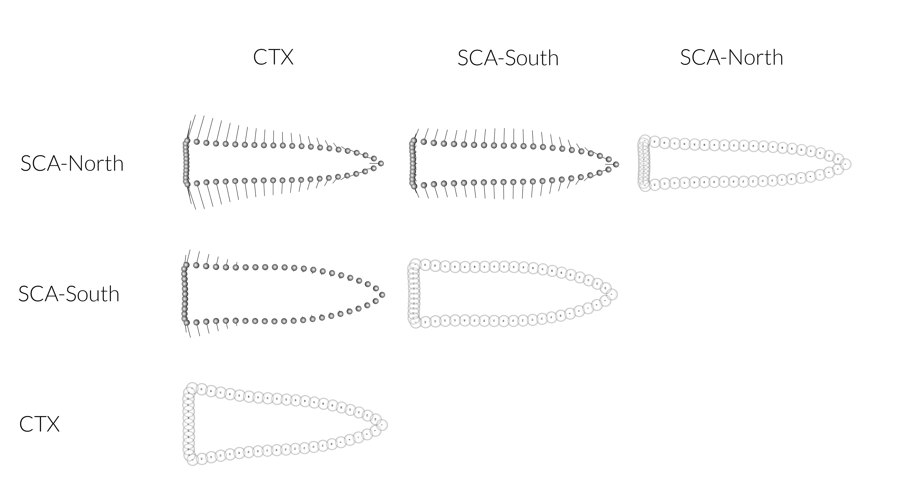

# Symmetry and Asymmetry

## Gahagan bifaces

Per Klingenberg [-@RN8579, 1912 and Figure 2]:

* Symmetric variation includes movements of the unpaired landmarks along the median axis (or within the median plane) and joint mirror-image shifts of pairs of corresponding landmarks in any direction.
* Asymmetry is quantified through the differences between the original and mirrored configuration from the symmetric consensus of the original and mirror image.

## Load packages + data

```{r load.data.asymm, echo = TRUE}
# load packages

# devtools::install_github("geomorphR/geomorph", ref = "Stable", build_vignettes = TRUE)
library(geomorph)
library(tidyverse)
library(wesanderson)

# setwd
setwd(getwd())

# read GM data
source('readmulti.csv.R')

# read .csv files
setwd("./data")
filelist <- list.files(pattern = ".csv")
coords <- readmulti.csv(filelist)
setwd("../")

# read qualitative data
qdata <- read.csv("qdata.csv", header = TRUE, row.names = 1)
qdata <- qdata[match(dimnames(coords)[[3]], rownames(qdata)),]
land.pairs <- read.csv("asymmetry.csv", header = TRUE)
ind <- rep(1:length(filelist))
```

## Generalized Procrustes Analysis

Landmark data were aligned to a global coordinate system [@RN11622;@RN11623;@RN11563], achieved through generalized Procrustes superimposition [@RN478] performed in R 4.0.2 [@R] using the `geomorph` library v. 3.3.1 [@RN11530;@RN1774]. Procrustes superimposition translates, scales, and rotates the coordinate data to allow for comparisons among objects [@RN11564;@RN478]. The `geomorph` package uses a partial Procrustes superimposition that projects the aligned specimens into tangent space subsequent to alignment in preparation for the use of multivariate methods that assume linear space [@RN1646;@RN11563].

```{r asymm.gpa, out.width = "100%", dpi = 300, echo=TRUE, warning=FALSE}
# gpa - bilateral asymmetry
res.bilat <- bilat.symmetry(coords,
                          ind = ind, 
                          object.sym = TRUE,
                          land.pairs = land.pairs,
                          RRPP = TRUE,
                          iter = 9999,
                          print.progress = FALSE)
summary(res.bilat)
```

```{r symm.shape, out.width = "100%", dpi = 300, echo=TRUE, warning=FALSE, fig.cap="_**Figure 3a-b. Mean shape (black) and specimens (gray) for the symmetric shape component plotted in 2D.**_"}
# symmetric shape/design intent
symm.shape <- res.bilat$symm.shape[,1:2,]
symm.shape2 <- res.bilat$symm.shape[,2:3,]

# plot all specimens/2D (symmetric component)
plotAllSpecimens(symm.shape)
plotAllSpecimens(symm.shape2)
```

```{r asymm.shape, out.width = "100%", dpi = 300, echo=TRUE, warning=FALSE, fig.cap="_**Figure 4a-b. Mean shape (black) and specimens (gray) for the asymmetric shape component plotted in 2D.**_"}
# asymmetric shape/standardization?
asymm.shape <- res.bilat$FA.component[,1:2,]
asymm.shape2 <- res.bilat$FA.component[,2:3,]

# plot all specimens/2D (asymmetric component)
plotAllSpecimens(asymm.shape)
plotAllSpecimens(asymm.shape2)
```

## Principal Components Analysis

Principal components analysis [@RN1746] was used to visualize shape variation among the bifaces. The shape changes described by each principal axis are commonly visualized using thin-plate spline warping of a reference 3D mesh [@RN1731;@RN479].

```{r pca.asymm, out.width = "100%", dpi = 300, echo=TRUE, warning=FALSE}
# geomorph data frame
gdf <- geomorph.data.frame(shape = res.bilat$symm.shape,
                           ashape = res.bilat$FA.component,
                           reg = qdata$region2,
                           mort = qdata$mortuary) 

# attributes
reg <- qdata$region2
mort <- qdata$mortuary

# principal components analysis (symmetric)
pca <- gm.prcomp(res.bilat$symm.shape)
summary(pca)

# set plot parameters to plot by region
pch.gps.reg <- c(15,17,18)[as.factor(reg)]
col.gps.reg <- wes_palette("Moonrise2")[as.factor(reg)]
col.hull.2 <- c("#798E87","#C27D38","#CCC591")

# set plot parameters to plot by mortuary context
pch.gps.mort <- c(15,17)[as.factor(mort)]
col.gps.mort <- wes_palette("Moonrise2")[as.factor(mort)]
col.hull.mort <- c("#798E87","#C27D38")
```

## Define models

### Hypothesis 1

```{r def.mod.1.asymm, out.width = "100%", dpi = 300, echo=TRUE, warning=FALSE}
# symmetric shape as a function of region
## (differences in design intent?)
reg.symm <- procD.lm(shape ~ reg, 
                     data = gdf, 
                     print.progress = FALSE, 
                     iter = 9999)

# asymmetric shape as a function of region
## (standardization?)
reg.asymm <- procD.lm(ashape ~ reg, 
                      data = gdf, 
                      print.progress = FALSE, 
                      iter = 9999)
```

### Hypothesis 2

```{r def.mod.2.asymm, out.width = "100%", dpi = 300, echo=TRUE, warning=FALSE}
# symmetric shape as a function of mortuary context
## (differences in design intent?)
mort.symm <- procD.lm(shape ~ mort, 
                     data = gdf, 
                     print.progress = FALSE, 
                     iter = 9999)

# asymmetric shape as a function of mortuary context
## (standardization?)
mort.asymm <- procD.lm(ashape ~ mort, 
                      data = gdf, 
                      print.progress = FALSE, 
                      iter = 9999)
```

```{r diagnostic, out.width = "100%", dpi = 300, echo=FALSE, warning=FALSE}
#par(mfrow = c(2,3))
#plot(reg.symm, type = "diagnostic", outliers = TRUE)
```

```{r diagnostic.asymm, out.width = "100%", dpi = 300, echo=FALSE, warning=FALSE}
#plot(reg.asymm, type = "diagnostic", outliers = TRUE)
```

## Hypothesis 1

Assessment of _design intent_ and _standardization_ by region.

### PCA (H1)

```{r symm.pca, out.width = "100%", dpi = 300, echo=TRUE, warning=FALSE, fig.cap="_**Figure 5. PCA (symmetric) for SCA-north (orange triangles), SCA-south (tan diamonds), and central Texas (gray squares).**_"}
# plot pca (symmetric) by region
pc.plot <- plot(pca, 
                 asp = 1,
                 pch = pch.gps.reg,
                 col = col.gps.reg)
                    shapeHulls(pc.plot, 
                               groups = reg,
                               group.cols = col.hull.2)
```

### Procrustes ANOVA (H1)

_Are there differences in the symmetric shapes of Gahagan bifaces found in the southern Caddo area (north/south) and central Texas?_

A residual randomization permutation procedure (RRPP; n = 10,000 permutations) was used for the Procrustes ANOVA [@RN1655;@RN11775], which has higher statistical power and a greater ability to identify patterns in the data should they be present [@RN1719]. To assess whether symmetric shape differs by group (region), Procrustes ANOVAs [@RN1749] were also run that enlist effect-sizes (zscores) computed as standard deviates of the generated sampling distributions [@RN1756].

```{r h1.asymm, out.width = "100%", dpi = 300, echo=TRUE, warning=FALSE}
# ANOVA: do symmetric gahagan biface point shapes differ by region?
## (are there differences in design intent?)
anova(reg.symm)

# pairwise comparison of LS means = which differ?
symm.reg <- pairwise(reg.symm,
                     groups = qdata$region2)
summary(symm.reg, 
        confidence = 0.95, 
        test.type = "dist")

# pairwise distance between variances = standardization?
summary(symm.reg, 
        confidence = 0.95, 
        test.type = "var")
```

### Mean Symmetric Shapes (H1)

Mean symmetric shapes were rendered and contrasted for each region, and illustrate those morphological differences that occur between each. These symmetric shapes may represent regional differences in _design intent_ related to the conceptual aesthetic of Gahagan bifaces, which differs significantly between all three regions (see above). Each region may also articulate with a period of discrete shape change in Gahagan biface morphology that began in the SCA-north, continued through the SCA-south, and terminated in central Texas (inference based upon the [chronological model](https://aksel-blaise.github.io/gahaganmorph3/temporal-dynamics.html#chronological-model-for-sca-north-sca-south-and-central-texas-contexts-yielding-gahagan-bifaces-with-baker-site-dates)).

```{r m.symm.shapes, out.width = "100%", dpi = 300, echo=TRUE, warning=FALSE, fig.cap="_**Figure 6. Comparison of mean symmetric shapes for Gahagan bifaces from the central Texas (CTX), southern Caddo area - South (SCA-South), and southern Caddo area - North (SCA-North) regions. The mean for each row is represented by gray spheres, which is compared with those shapes in each column using linear vectors.**_"}
# subset landmark coordinates to produce mean shapes for groups
## (design intent)
new.coords <- coords.subset(A = res.bilat$symm.shape, 
                            group = qdata$region2)
names(new.coords)

# group shape means
mean <- lapply(new.coords, mshape)

# plot mean shapes
plot(mean$CTX)
plot(mean$`SCA-north`)
plot(mean$`SCA-south`)

# comparison plots
plotRefToTarget(mean$`SCA-north`,
                mean$`SCA-south`, 
                method = "vector",
                mag = 2)
plotRefToTarget(mean$`SCA-north`,
                mean$CTX, 
                method = "vector",
                mag = 2)
plotRefToTarget(mean$`SCA-south`,
                mean$CTX, 
                method = "vector",
                mag = 2)


```

### Morphological disparity (H1)

_Does fluctuating asymmetry (standardization) vary between regions?_

Morphological disparity is estimated as the Procrustes variance, for groups in this instance, using residuals of a linear model fit [@RN11530]. Procrustes variance is the same sum of the diagonal elements of the group covariance matrix divided by the number of observations in the group [@RN5703;@RN11530]. Absolute differences in Procrustes variances are test statistics that can be used to test differences in morphological disparity among groups [@RN11530]. These differences are statistically evaluated through permutation, where the vectors of residuals are randomized among groups [@RN11530].

```{r m-disparity.region, out.width = "100%", dpi = 300, echo=TRUE, warning=FALSE}
# morphological disparity: do any of the groups display greater asymmetric 
# shape variation among individuals relative to the other group?
## (standardization?)
morphol.disparity(reg.asymm, 
                  groups = qdata$region2, 
                  data = gdf, 
                  print.progress = FALSE, 
                  iter = 9999)
```

## Hypothesis 2

Assessment of _design intent_ and _standardization_ by mortuary context.

### Principal Components Analysis (H2)

```{r symm.pca.2, out.width = "100%", dpi = 300, echo=TRUE, warning=FALSE, fig.cap="_**Figure 5. PCA (symmetric) for SCA-north (orange triangles), SCA-south (tan diamonds), and central Texas (gray squares).**_"}
# plot pca (symmetric) by region
pc.plot2 <- plot(pca, 
                 asp = 1,
                 pch = pch.gps.mort,
                 col = col.gps.mort)
                    shapeHulls(pc.plot2, 
                               groups = mort,
                               group.cols = col.hull.mort)
```

### Procrustes ANOVA (H2)

_Are there differences in the symmetric shapes of Gahagan bifaces found in/out of mortuary contexts?_

A residual randomization permutation procedure (RRPP; n = 10,000 permutations) was used for the Procrustes ANOVA [@RN1655;@RN11775], which has higher statistical power and a greater ability to identify patterns in the data should they be present [@RN1719]. To assess whether symmetric shape differs by group (region), Procrustes ANOVAs [@RN1749] were also run that enlist effect-sizes (zscores) computed as standard deviates of the generated sampling distributions [@RN1756].

```{r h2.symm, out.width = "100%", dpi = 300, echo=TRUE, warning=FALSE}
# ANOVA: do symmetric gahagan biface point shapes differ by mortuary context?
## (are there differences in design intent?)
anova(mort.symm)
```


### Mean Asymmetric Shapes (H2)

Mean asymmetric shapes were rendered and contrasted for Gahagan bifaces recovered in/out of mortuary contexts, and illustrate those morphological differences that occur between each. These symmetric shapes may represent differences in _design intent_ related to the conceptual aesthetic of Gahagan bifaces, which differs significantly between mortuary contexts (see above). 

```{r m.symm.shapes.mort, out.width = "100%", dpi = 300, echo=TRUE, warning=FALSE, fig.cap="_**Figure 6. Comparison of mean symmetric shapes for Gahagan bifaces recovered in/out of mortuary contexts. The mean for each row is represented by gray spheres, which is compared using linear vectors.**_"}
# subset landmark coordinates to produce mean shapes for groups
## (design intent)
new.coords2 <- coords.subset(A = res.bilat$symm.shape,
                             group = qdata$mortuary)

names(new.coords2)

# group shape means
mean2 <- lapply(new.coords2, mshape)

# plot mean shapes
plot(mean2$yes)
plot(mean2$no)


# comparison plots
plotRefToTarget(mean2$yes,
                mean2$no,
                method = "vector",
                mag = 2)

#
```

### Morphological disparity (H2)

_Does fluctuating asymmetry vary more when Gahagan bifaces are found in/out of mortuary contexts?_

Morphological disparity is estimated as the Procrustes variance, for groups in this instance, using residuals of a linear model fit [@RN11530]. Procrustes variance is the same sum of the diagonal elements of the group covariance matrix divided by the number of observations in the group [@RN5703;@RN11530]. Absolute differences in Procrustes variances are test statistics that can be used to test differences in morphological disparity among groups [@RN11530]. These differences are statistically evaluated through permutation, where the vectors of residuals are randomized among groups [@RN11530].

```{r m-disparity.mortuary, out.width = "100%", dpi = 300, echo=TRUE, warning=FALSE}
# morphological disparity: do any of the groups display greater asymmetric 
# shape variation among individuals relative to the other group?
## (standardization?)
morphol.disparity(mort.asymm, 
                  groups = qdata$mortuary, 
                  data = gdf, 
                  print.progress = FALSE, 
                  iter = 9999)
```
