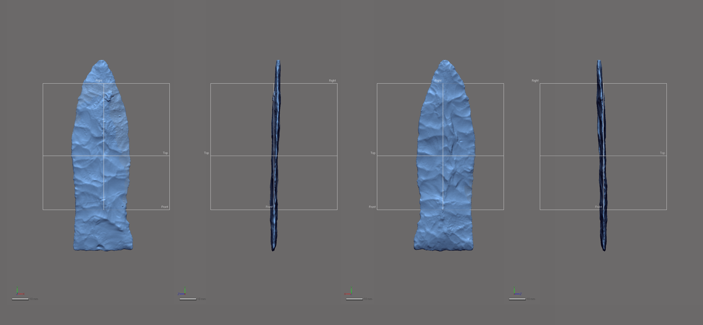
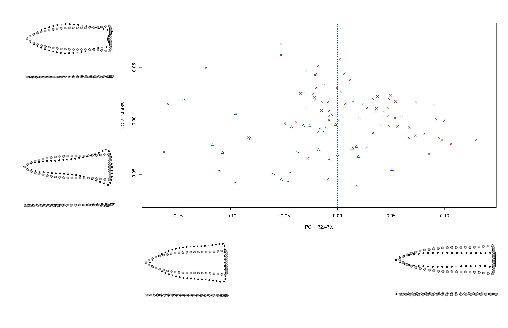
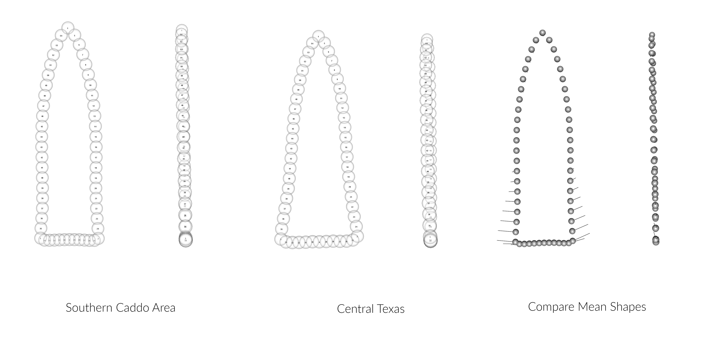

--- 
title: "Supplementary materials for paper: Shape difference or shape change? Temporal and spatial dynamics of Gahagan biface morphology"
author: "Robert Z. Selden, Jr."
date: "`r Sys.Date()`"
site: bookdown::bookdown_site
documentclass: book
bibliography: [book.bib]
biblio-style: apalike
link-citations: yes
description: "Gahagan biface shape change."
---

# Preliminaries {-}

This volume is written in _Markdown_, and all files needed to reproduce it are included in the [GitHub repository](https://github.com/aksel-blaise/gahaganmorph3), which is digitally curated on the Open Science Framework. The reproducible nature of this undertaking provides a means for others to critically assess and evaluate the various analytical components [@RN20915;@RN20916;@RN20917], which is a necessary requirement for the production of reliable knowledge.

This investigation follows two recent morphological studies of the largest samples of Gahagan bifaces, and seeks to further characterize local morphological variation using intact or reconstructed Gahagan bifaces from Caddo and central Texas contexts. Gahagan bifaces are thought to have been imported from central Texas hunter-gatherers. While differences in Gahagan biface morphology have been demonstrated between the southern Caddo area and central Texas, this study posits that these differences represent potential shape changes through time. Results provide a preview of the dynamic temporal and morphological relationships associated with Gahagan bifaces recovered from Caddo and central Texas sites. Two models of Gahagan biface shape change are postulated, which warrant additional testing.

```{r gahagan, out.width = "100%", dpi = 300, echo=TRUE, warning=FALSE, fig.cap="Gahagan bifaces from the southern Caddo area (SCA) and central Texas."}
# embed image
knitr::include_graphics('images/figure01.jpg')
```

Reproducibility projects in [psychology](https://osf.io/ezcuj/) and [cancer biology](https://www.cos.io/rpcb) are impacting current research practices across all domains. Examples of reproducible research are becoming more abundant in archaeology [@RN20804;@RN21009;@RN21001], and the next generation of archaeologists are learning those tools and methods needed to reproduce and/or replicate research results [@RN21007]. Reproducible and replicable research work flows are often employed at the highest levels of humanities-based inquiries to mitigate concern or doubt regarding proper execution, and is of particular import should the results have—explicitly or implicitly—a major impact on scientific progress [@RN21008].

Components of the undertaking presented in this volume are novel, and this basic research endeavour is rooted in archaeological epistemology. Sharing data is not enough, and if investigators share only data absent their analysis code, that places a substantive burden on those who may seek to build upon or replicate our work in the future. In this instance, the choice to pursue a replicable work flow occurs based upon the simple fact that this work is foundational, and meant to begin a discussion of the potential Gahagan biface shape trajectories.

## Acknowledgments

I extend my gratitude to the Caddo Tribe of Oklahoma, the Williamson Museum at Northwestern State University, the Louisiana State Exhibit Museum, the Texas Archeological Research Laboratory at The University of Texas at Austin, the Brazos Valley Museum of Natural History, the Texas Parks and Wildlife Department, and the Sam Noble Oklahoma Museum of Natural Science for the requisite permissions and access needed to generate the scans of the Hickory Engraved and Smithport Plain bottles, and the Gahagan bifaces. Thanks to Harry J. Shafer, Jeffrey S. Girard, Hiram F. (Pete) Gregory, Julian A. Sitters, Timothy K. Perttula, and David K. Thulman for their comments on a draft of this manuscript. Thanks also to Dean C. Adams, Michael L. Collyer, Emma Sherratt, Lauren Butaric, and Kersten Bergstrom for their constructive criticisms, comments, and suggestions throughout the development of this research programme, and to the editors and anonymous reviewers for their comments and constructive criticisms, which further improved the manuscript.

## Funding

Components of this analytical work flow were developed and funded by a Preservation Technology and Training grant (P14AP00138) to the author from the National Center for Preservation Technology and Training (NCPTT), and additional grants to the author from the Caddo Tribe of Oklahoma and the National Forests and Grasslands in Texas (15-PA-11081300-033 and 20-PA-11081300-074). Funding to scan the Gahagan bifaces at the Williamson Museum at Northwestern State University, Louisiana State Exhibit Museum, Texas Archeological Research Laboratory at The University of Texas at Austin, and Sam Noble Oklahoma Museum of Natural Science was provided to the author by the Heritage Research Center at Stephen F. Austin State University.

<!--chapter:end:index.Rmd-->

# Temporal Dynamics

Further information regarding the radiocarbon dates discussed below can be found in the text of the previous article [@RN21001], and those references cited below.

```{r install, echo = TRUE}
# devtools::install_github('ISAAKiel/oxcAAR')
# load oxcAAR and OxCal
library(oxcAAR)
quickSetupOxcal()
```

## Calibration and plots for dates from Burial Pit 5 at the Mounds Plantation site

Three dates (Tx-55, Tx-56, and M-1466) were reported from Burial Pit 5 at the Mounds Plantation site. More information about these dates can be found in the text, and those works cited within the text of the manuscript.

```{r mplcal, echo=TRUE}
moundspl<-data.frame(bp=c(860,900),
                     std=c(120,100),
                     names=c("Tx-55","M-1466")
)
moundsplcal<-oxcalCalibrate(moundspl$bp,moundspl$std,moundspl$names)
moundsplcal
plot(moundsplcal)
calcurve_plot(moundsplcal)
```

## Calibration and plots for dates from Burial Pit 2 at the Gahagan Mound site

Three AMS dates (UGA12296, ISGS A0465, and ISGS A0466) were reported from Burial Pit 2 at the Gahagan Mound site. More information about these dates can be found in the text, and those works cited within the text of the manuscript.

```{r gahagancal, echo=TRUE}
gahagan<-data.frame(bp=c(1000,950,910),
                    std=c(40,40,35),
                    names=c("UGA-12296","ISGS-A0466","ISGS-A0465")
)
gahagancal<-oxcalCalibrate(gahagan$bp,gahagan$std,gahagan$names)
gahagancal
plot(gahagancal)
calcurve_plot(gahagancal)
```

## Calibration and plots for the dates from F119 and F134 at the George C. Davis site

Two dates (Tx-913 and Tx-1206) were reported from Features 119 and 134, respectively. More information about these dates can be found in the text, and those works cited within the text of the manuscript.

```{r GCDcal, echo=TRUE}
gcd<-data.frame(bp=c(1150,986),
                std=c(80,90),
                names=c("Tx-913","Tx-1206")
)
gcdcal<-oxcalCalibrate(gcd$bp,gcd$std,gcd$names)
gcdcal
plot(gcdcal)
calcurve_plot(gcdcal)
```

## Calibration and plots for dates from AU2 at the J. B. White site

Seventeen dates (Beta-176624, UGA-12500, UGA-12509, UGA-12497, UGA-12498, UGA-12505, UGA-12495, Beta-176625, Beta-176623, UGA-12494, UGA-12503, UGA-12499, Beta-176620, Beta-176627, Beta-176628, UGA-12493, Beta-176630) were reported from AU2 at the J. B. White site. More information about these dates can be found in the text, and those works cited within the text of the manuscript.

```{r jbwcal, echo=TRUE}
jbw<-data.frame(bp=c(1190,1090,1090,1050,1030,990,980,980,970,970,950,920,910,890,880,860,710),
                     std=c(50,40,40,40,40,40,40,40,40,40,40,40,40,40,40,40,40),
                     names=c("Beta-176624","UGA-12500","UGA-12509","UGA-12497","UGA-12498", "UGA-12505","UGA-12495","Beta-176625","Beta-176623","UGA-12494","UGA-12503","UGA-12499","Beta-176620","Beta-176627","Beta-176628","UGA-12493","Beta-176630")
)
jbwcal<-oxcalCalibrate(jbw$bp,jbw$std,jbw$names)
jbwcal
plot(jbwcal)
calcurve_plot(jbwcal)
```

## Calibration and plots for the dates from the Baker site

Three dates (D-AMS 035170, D-AMS 035169, D-AMS 035290) were reported from the Baker site. More information about these dates can be found in the text, and those works cited within the text of the manuscript.

```{r bkrcal, echo=TRUE}
bkr<-data.frame(bp=c(667,648,624),
                std=c(24,22,28),
                names=c("D-AMS 035170","D-AMS 035169","D-AMS 035290")
)
bkrcal<-oxcalCalibrate(bkr$bp,bkr$std,bkr$names)
bkrcal
plot(bkrcal)
calcurve_plot(bkrcal)
```

## Summed probability distributions for contexts yielding Gahagan bifaces

A summed probability distribution is presented for all dates, then each site. Those dates from the same wood specimen at the Mounds Plantation site (M-1466 and Tx-55) were not combined for these distributions. Outliers mentioned in the text of the article are omitted from the summed probability distributions for contexts yielding Gahagan bifaces.

```{r sumcal, echo=TRUE}
# plot spd for all contexts yielding Gahagan bifaces
spdall<-R_Date(c("Beta-176624","Tx-913","UGA-12500","UGA-12509","UGA-12497","UGA-12498","UGA-12296","UGA-12505","UGA-12495","Beta-176625","Beta-176623","UGA-12494","UGA-12503","ISGS-A0466","UGA-12499","Beta-176620","ISGS-A0465","M-1466","Tx-55","Beta-176627","Beta-176628","UGA-12493","Beta-176630","D-AMS 035170","D-AMS 035169","D-AMS 035290"), c(1190,1150,1090,1090,1050,1030,1000,990,980,980,970,970,950,950,920,910,910,900,860,890,880,860,710,667,648,624), c(50,80,40,40,40,40,40,40,40,40,40,40,40,40,40,40,35,100,120,40,40,40,40,24,22,28))
cat(spdall)
sumall<-oxcal_Sum(spdall)

cat(sumall)

library(magrittr)

sumall.cal <- sumall %>% executeOxcalScript() %>% readOxcalOutput() %>% parseOxcalOutput(first = T, only.R_Date = F)

str(sumall.cal)
plot(sumall.cal)

#simulate spd using the same date range, number of dates, and mean error. timeframe_begin (760) was calculated by subtracting 1190 from 1950, timeframe_end by subtracting 624 from 1950, with n = the same number of dates in the original sample, and stds = the average of the standard deviations within the original sample.
sum_sim<-oxcalSumSim(
  timeframe_begin = 760,
  timeframe_end = 1326,
  n = 26,
  stds = 45,
  date_distribution = "uniform"
)
str(sum_sim)
plot(sum_sim)
```

## Chronological model for SCA-north, SCA-south, and central Texas contexts yielding Gahagan bifaces with Baker site dates

For reasons explained in the text, Tx-1206 and Tx-56 are included in the model as outliers. The script that appears below achieves the same results in R and in OxCal. Due to the fact that the Baker site dates do not articulate directly with the Gahagan biface, they are included in the first model, and omitted from the second. 

```{r chronmod1, echo=TRUE}
knitr::opts_chunk$set(cache=TRUE)
# chronological model with Baker site dates
gahaganmod <- 'Plot()
 {
  Phase("Contexts yielding Gahagan bifaces")
  {
   Sequence("Gahagan bifaces")
   {
    Boundary("start Gahagan bifaces SCA-north");
    Phase("SCA-north")
    {
     R_Combine("Log 1")
     {
      R_Date("M-1466", 900, 100);
      R_Date("Tx-55", 860, 120);
     };
     R_Date("Tx-56", 475, 100)
     {
      Outlier();
     };
    };
    Boundary("end Gahagan bifaces SCA-north");
    Boundary("start Gahagan bifaces SCA-south");
    Phase("SCA-south")
    {
     R_Date("Tx-913", 1150, 80);
     R_Date("UGA-12296", 1000, 40);
     R_Date("Tx-1206", 986, 90)
     {
      Outlier();
     };
     R_Date("ISGS-A0466", 950, 40);
     R_Date("ISGS-A0465", 910, 35);
    };
    Boundary("end Gahagan bifaces SCA-south");
    Boundary("start Gahagan bifaces CTX");
    Phase("central Texas")
    {
     R_Date("Beta-176624", 1190, 50);
     R_Date("UGA-12500", 1090, 40);
     R_Date("UGA-12509", 1090, 40);
     R_Date("UGA-12497", 1050, 40);
     R_Date("UGA-12498", 1030, 40);
     R_Date("UGA-12505", 990, 40);
     R_Date("UGA-12495", 980, 40);
     R_Date("Beta-176625", 980, 40);
     R_Date("Beta-176623", 970, 40);
     R_Date("UGA-12494", 970, 40);
     R_Date("UGA-12503", 950, 40);
     R_Date("UGA-12499", 920, 40);
     R_Date("Beta-176620", 910, 40);
     R_Date("Beta-176627", 890, 40);
     R_Date("Beta-176628", 880, 40);
     R_Date("UGA-12493", 860, 40);
     R_Date("Beta-176630", 710, 40);
     R_Date("D-AMS 035170", 667, 24);
     R_Date("D-AMS 035169", 648, 22);
     R_Date("D-AMS 035290", 624, 28);
    };
    Boundary("end Ghagan Bifaces CTX");
   };
  };
 };
'
  gahaganmod_results <- executeOxcalScript(gahaganmod) 
  gahaganmod_text <- readOxcalOutput(gahaganmod_results)
  gahaganmod_result_data <- parseOxcalOutput(gahaganmod_text, only.R_Date = F)
  str(gahaganmod_result_data)
  print(gahaganmod_result_data)
  plot(gahaganmod_result_data)
# plot start/end boundaries for contexts yielding gahagan bifaces in sca and ctx with Baker site dates
  gahaganmod_result_data %>%
    sapply(function(x) x$type %in% c("Boundary")) %>%
    gahaganmod_result_data[.] %>%
    oxcAAR:::plot.oxcAARCalibratedDatesList()
```

This second iteration of the chronological model does not include the dates from the Baker site. 

```{r chronmod2, echo=TRUE}
# chronological model without Baker site dates
gahaganmod2 <- 'Plot()
 {
  Phase("Contexts yielding Gahagan bifaces")
  {
   Sequence("Gahagan bifaces")
   {
    Boundary("start Gahagan bifaces SCA-north");
    Phase("SCA-north")
    {
     R_Combine("Log 1")
     {
      R_Date("M-1466", 900, 100);
      R_Date("Tx-55", 860, 120);
     };
     R_Date("Tx-56", 475, 100)
     {
      Outlier();
     };
    };
    Boundary("end Gahagan bifaces SCA-north");
    Boundary("start Gahagan bifaces SCA-south");
    Phase("SCA-south")
    {
     R_Date("Tx-913", 1150, 80);
     R_Date("UGA-12296", 1000, 40);
     R_Date("Tx-1206", 986, 90)
     {
      Outlier();
     };
     R_Date("ISGS-A0466", 950, 40);
     R_Date("ISGS-A0465", 910, 35);
    };
    Boundary("end Gahagan bifaces SCA-south");
    Boundary("start Gahagan bifaces CTX");
    Phase("central Texas")
    {
     R_Date("Beta-176624", 1190, 50);
     R_Date("UGA-12500", 1090, 40);
     R_Date("UGA-12509", 1090, 40);
     R_Date("UGA-12497", 1050, 40);
     R_Date("UGA-12498", 1030, 40);
     R_Date("UGA-12505", 990, 40);
     R_Date("UGA-12495", 980, 40);
     R_Date("Beta-176625", 980, 40);
     R_Date("Beta-176623", 970, 40);
     R_Date("UGA-12494", 970, 40);
     R_Date("UGA-12503", 950, 40);
     R_Date("UGA-12499", 920, 40);
     R_Date("Beta-176620", 910, 40);
     R_Date("Beta-176627", 890, 40);
     R_Date("Beta-176628", 880, 40);
     R_Date("UGA-12493", 860, 40);
     R_Date("Beta-176630", 710, 40);
    };
    Boundary("end Ghagan Bifaces CTX");
   };
  };
 };
'
  gahaganmod2_results <- executeOxcalScript(gahaganmod2) 
  gahaganmod2_text <- readOxcalOutput(gahaganmod2_results)
  gahaganmod2_result_data <- parseOxcalOutput(gahaganmod2_text, only.R_Date = F)
  str(gahaganmod2_result_data)
  print(gahaganmod2_result_data)
  plot(gahaganmod2_result_data)
# plot start/end boundaries for contexts yielding gahagan bifaces in sca and ctx without Baker site dates
  gahaganmod2_result_data %>%
    sapply(function(x) x$type %in% c("Boundary")) %>%
    gahaganmod2_result_data[.] %>%
    oxcAAR:::plot.oxcAARCalibratedDatesList()
# end of script
```

## Acknowledgments

Thanks to Martin Hinz for fielding questions related to the oxcAAR package, and to Derek Hamilton for his guidance with the chronological models.

<!--chapter:end:02-gahagan14c.Rmd-->

# Modeling Geometry

Two Gahagan bifaces, both from the George C. Davis site (4078-8, and 4078-72), were missing small sections of the blade along the lateral edge. This analysis limited the inclusion of specimens with missing data to those where the area of missing data was smaller than a dime (10-cent coin in the US), ensuring that modeling was kept to a minimum.

Modeling was completed in _Geomagic Design X (Build Version 2019.0.2 [Build Number: 78])_. Modeling occurred in advance of the `auto3dgm` alignment. Following alignment, these two specimens were landmarked following the same [landmarking protocol](landmarking-protocol.md) as the unmodeled bifaces.

In both cases, the area of highest concern was that of the lateral edge. To ensure that the fit followed the existing contour, the area was first cut and cleaned, then bridges were constructed that enlisted variable curvature, following with the existing curvature of the edge. Once fitted with the bridge, the remaining holes on either side were filled following those protocols set forth in [@RN11521].

The images that follow include a before and after modeling image of each biface, illustrating the area of the biface that was missing, and the subsequent model that was used in the geometric morphometric analysis. In the case of 4078-8, one semilandmark was included in the modeled area. No semilandmarks were placed in the modeled area of 4078-72.

## 4078-8

```{r fig4078-8-init, out.width = "100%", dpi = 300, echo=TRUE, warning=FALSE, fig.cap="Gahagan biface 4078-8, before modeling."}
knitr::include_graphics('images/41ce19-4078-8-unmodeled.png')
```

```{r fig4078-8-mod, out.width = "100%", dpi = 300, echo=TRUE, warning=FALSE, fig.cap="Gahagan biface 4078-8, after modeling."}
knitr::include_graphics('images/41ce19-4078-8-modeled.png')
```

## 4078-72

```{r fig4078-72-init, out.width = "100%", dpi = 300, echo=TRUE, warning=FALSE, fig.cap="Gahagan biface 4078-72, before modeling."}
knitr::include_graphics('images/41ce19-4078-72-unmodeled.png')
```

```{r fig4078-72-mod, out.width = "100%", dpi = 300, echo=TRUE, warning=FALSE, fig.cap="Gahagan biface 4078-72, after modeling."}

```

## References cited

<!--chapter:end:03-modeling-geometry.Rmd-->

# Landmarking Protocol

The landmarking protocol developed for this project represents a substantial methodological advancement when contrasted with those protocols used in previous studies of Gahagan biface morphology [@RN11783;@RN21001]. This protocol represents the continued evolution of a research programme concerned with the development of a rigorous and replicable three-dimensional (3D) landmarking workflow, which simultaneously takes into account the complex design elements associated with individual bifaces. Landmark (LM) and semilandmark (sLM) placement was achieved through the construction of reference geometry in _Geomagic Design X (Build Version 2020.0.1 [Build Number: 30])_, used to expand the previous LM configuration, and capitalise upon additional design attributes. Reference geometry provides the foundation needed to apply the LM and sLM points at mathematically-defined locations. The result is a LM and sLM configuration that articulates with specific morphological features (plan views, profiles, and cross-sections), which have demonstrated utility in wide-ranging studies of biface and projectile point morphology.

```{r fig.bev.x, fig.cap="Gahagan biface 545 from the Gahagan Mound site, illustrating axial twisting."}
knitr::include_graphics('images/figbev.png')
```

## Foundations

```{r fig.gahaganmorph, fig.cap="The landmarking protocol used in the 2D analysis of Gahagan bifaces, where all landmarks and semilandmarks were projected onto a plane."}
knitr::include_graphics('images/gahaganmorph.jpg')
```

```{r fig.gahaganmorph2, fig.cap="The first [3D landmarking protocol](https://github.com/aksel-blaise/gahaganmorph2/blob/master/analysis/landmarking-protocol.md) (LM3d1) used to analyse Gahagan bifaces, which captured those attributes associated with axial twisting."}
knitr::include_graphics('images/gahaganmorph2.png')
```

The goal of this effort was to increase the precision and rigour of the study by including the Z-dimension to capture those morphological characteristics associated with axial twisting, thought to have been introduced by knappers through bifacial bevelling. This landmarking protocol is the culmination of the iterative design process that began during the previous 2D [@RN11783] and 3D [@RN21001] geometric morphometric analyses. The cross-sections increase the coverage of sLMs across mesh topology, providing for greater precision in the analysis of whole-object morphology, and can be subset as a means of analysing specific features of interest. For instance, might the previously-noted morphological differences that occur in plan view [@RN11783;@RN21001] also extend to Gahagan biface profiles and cross-sections? 

The continued evolution of this landmarking protocol represents a concerted effort to better comprehend the vagaries of morphological similarities and differences among Gahagan bifaces. While true that some landmarking protocols can be---and often are---recycled as new specimens are added, this particular research programme endeavours to achieve ever-greater accuracy and precision in each subsequent iteration.

## Spline 1

A spline was extracted using the surface geometry of the mesh with the `extract contour curves` command that allows for detection and extraction of 3D contour curves from high-curvature areas of the mesh. In reverse-engineering, `extract contour curves` is regularly employed as the first step in building a `patch network` used to construct a surface. The extracted feature curve is rendered as a spline, and follows the highest curvature contours around the periphery of the lateral and basal edges, following the highly variable sinuous edge morphology around the entirety of the biface [@RN21001]. The remainder of the landmarking protocol is based upon this spline, which was subsequently split at four mathematically-defined locations [@RN21001].

```{r figspline, out.width = "100%", dpi = 300, echo=TRUE, warning=FALSE, fig.cap="Spline extracted along the highest contours of the projectile."}
knitr::include_graphics('images/extractspline.png')
```

### Splitting Spline 1

_A few definitions are warranted before proceeding. `Reference geometries` are used in the assistance of creating other features. These include basic geometric entities, such as `planes`, `vectors`, `coordinates`, `points`, and `polygons`. A `reference point` is a virtual point and is used to mark a specific position on a model or in 3D space. A `reference plane` is a virtual plane that has a normal direction and an infinite size. A `reference plane` is not a surface body, and is used to create other features._ 

The characteristic points and tangents developed for this landmarking protocol were inspired by the work of Birkhoff [-@RN11786]. The first landmark (LM 01) is placed at the horizontal tangent on the tip of each Gahagan biface [@RN21001]. The second and third splits (LM 02 and LM 03) occur at points of highest curvature, and LM 02 is always split on the right side of the biface when oriented in 3D space following the alignment output of _auto3dgm_ [@RN21001]. To place the final landmark (LM 04), a linear measurement was used to project a reference point equidistant between LM 02 and LM 03 [@RN21001]. The location of that point was leveraged in placing the reference plane used to cut the spline at the location of LM 04 [@RN21001].

#### Split Spline 1 at location of LM 01

The `horizontal tangent` is calculated by drawing a horizontal line above the tip of each biface using the tangent as a `common constraint`, and the horizontal as the `independent constraint`. To split the 3D spline at the location of the horizontal tangent, a `reference point` was inserted at the location of the `tangent` in the 2D sketch (light blue point; below, left), followed by a `reference plane` (in white; below, left and right) using the `pick point and normal axis` function where the `reference point` (h-tangent) was used as the `pick point`, and the `Right plane` as the `normal axis` (below, left). The 3D spline was then cut at the location where the `reference plane` intersected with the spline (below image, right).

```{r figlm1, out.width = "100%", dpi = 300, echo=TRUE, warning=FALSE, fig.cap="Identify horizontal tangent, insert reference point and reference plane (left). Use reference plane to cut spline at the location of the horizontal tangent (right)."}
knitr::include_graphics('images/lm1.png')
```

#### Split Spline 1 at locations of LM 02 and LM 03

The point of highest curvature on either side of the basal edge was calculated using the `curvature` function in the Accuracy Analyser. This function displays the curvature flow as a continuous colour plot across the area of the curve. In this instance, _curvature_ is defined as the amount by which a geometric shape deviates from being flat or straight in the case of a line. The curvature is displayed in different colours according to the local radius, and is calculated in only one direction (U or V) along the curve. Using this tool, the two points of highest curvature were located between the basal and lateral edges on either side of each biface where the local radius measure was largest. The alignment and orientation of each biface was dictated by the _auto3dgm_ output, and the landmarking protocol follows the mesh orientation, where LM 02 was always placed on the right side of the basal edge, and LM03 on the left.

```{r figcurve, out.width = "100%", dpi = 300, echo=TRUE, warning=FALSE, fig.cap="Identify points of hightest curvature (light blue) at left/right intersection of lateral and basal edges."}
knitr::include_graphics('images/splinesplit1.png')
```

#### Split Spline 1 at location of LM 04

One additional landmark (LM 04) was placed at the centre of the base. The location of this LM was identified by calculating the linear distance between LM2 and LM3, and projecting a `reference point` (ctrl-div; below) equidistant between the two. A `reference plane` was added using the ctrl-div as the pick point, and the `Right plane` as the `normal axis`. The spline was then split at the intersection of the `reference plane` and the basal spline.

```{r figlm4, out.width = "100%", dpi = 300, echo=TRUE, warning=FALSE, fig.cap="Calculate linear distance between LM2 and LM3, insert reference plane coplanar to Right plane equidistant between LM2 and LM3, and use the reference plane to cut the spline."}
knitr::include_graphics('images/lm4.png')
```

## New reference geometry

Each of the preceding protocols were used in the previous analysis of Gahagan bifaces [@RN21001], and this section outlines the logical evolution of the previous landmarking protocol. The resulting constellation of LM and sLM points can be subset to test a wide range of hypotheses associated with the plan and profile views of bifaces, in addition to specific cross-sections. Each of the cross-sections is also split between LM 01 and LM04, allowing for analyses of bilateral asymmetry. 

### Vector 1, Point 2, and Plane 2

A linear `reference vector` (vector1) was inserted between LM 01 and LM 04, and a `reference point` (ref.pt.2) placed equidistant between the two landmarks along vector1. The Z-coordinates of ref.pt.2 were altered to relocate it 15mm from vector1 in the direction of the Z-axis, while otherwise maintaining its' alignment with vector 1. The `pick point and coplanar` function was used to place a `reference plane` (Plane 2) along vector1 in the direction of ref.pt.2, bisecting the biface along the Z-axis---perpendicular to the lateral edges---between LM 01 and LM 04.

```{r vecptplane, out.width = "100%", dpi = 300, echo=TRUE, warning=FALSE, fig.cap="Vector placed between LM 01 and 04, ref.pt.2 equidistant between the landmarks along the vector, then the Z-coordinates were altered to offset the point 15mm from the vector (left two images). The vector and ref.pt.2 were subsequently used to place a plane coplanar to the vector in the direction of ref.pt.2 using the `pick point and coplanar axis` function (right two images)."}
knitr::include_graphics('images/vecptplane.png')
```

### Planes 3 and 4

Using the same method, a `reference vector` (vector2) was inserted between LM 02 and LM 03, and a `reference point` (ref.pt.3) was placed equidistant between the two LMs along vector 2. The Z-coordinates of ref.pt.3 were similarly altered to relocate it 15 mm from vector2 in the direction of the Z-axis. The `pick point and coplanar axis` function was used to place a `reference plane` (Plane 3) along vector 2 in the direction of ref.pt.3, bisecting the biface along the X-axis---parallel to the base---between LM 02 and LM 03. A fourth `reference plane` (Plane 4) was subsequently inserted using the `pick point and normal axis` function that yielded a plane at the intersection of LM 01 and vector1. These two planes serve as the basis for the equidistant cross-sections.

```{r plane3.4, out.width = "100%", dpi = 300, echo=TRUE, warning=FALSE, fig.cap="Vector placed between LM 01 and 04, ref.pt.2 equidistant between the landmarks along the vector, then the Z-coordinates were altered to offset the point 15mm from the vector (left two images). The vector and ref.pt.3 were subsequently used to place a plane coplanar to the vector in the direction of ref.pt.3 using the `pick point and coplanar axis` function. Plane 4 was inserted using the `pick point and normal axis` function with vector1 as the normal axis, and LM 01 as the pick point."}
knitr::include_graphics('images/plane3-4.png')
```

## Cross-sections

Ten equidistant cross-sections were inserted between the `reference planes` (Planes 3 and 4) using the `section` function. The resulting cross-sections are split at the points of highest curvature on the lateral edges, and along the mid-line of the point where they intersect with Plane 2.

```{r cross.10, out.width = "100%", dpi = 300, echo=TRUE, warning=FALSE, fig.cap="Ten equidistant cross-sections were inserted between Plane 3 and Plane 4."}
knitr::include_graphics('images/cross.10.png')
```

### Splitting cross-sections (Step 1)

Cross-sections were split at the intersection of the horizontal splines and Plane 2. The resulting reference geometry provides a means of analyzing the contribution of the morphology associated with the projectile's profile, and divides the landmarking configuration into two discrete components (L/R) that can be used in subsequent analyses of bilateral asymmetry.

```{r cut.cross.plane2, out.width = "100%", dpi = 300, echo=TRUE, warning=FALSE, fig.cap="Cross-sections were cut where they intersect with Plane 2, along the mid-line of the projectile between LM 01 and LM 04."}
knitr::include_graphics('images/cut.cross.plane2.png')
```

### Splitting cross-sections (Step 2)

Cross sections were split at points of highest curvature along the lateral edges of the projectile. These sLMs contribute to the analysis of the projectile in plan view, but also follow the dynamic 3D contours associated with the sinuous edge.

```{r pt.high.curv.split, out.width = "100%", dpi = 300, echo=TRUE, warning=FALSE, fig.cap="Spline splits (blue dots) along the lateral edges occur at the point of highest curvature. These splits occur at known coordinates used to add the semilandmarks."}
knitr::include_graphics('images/pt.high.curv.split.png')
```

## Landmark and semilandmark placement

LMs 01-04 were placed at the locations of spline splits following the same protocol enlisted by the previous study (blue points, below) [@RN21001]. Five equidistant sLMs were added between LM 02 and LM 04, and between LM 04 and LM 03. Along the mid-line, sLMs were numbered from top to bottom along front and back, then from top to bottom along the right and left lateral edges, using the output alignment dictated by _auto3dgm_. Four additional semilandmarks were placed equidistant between the lateral edge and mid-line on each of the 10 horizontal splines.

```{r figlmslm-all, out.width = "100%", dpi = 300, echo=TRUE, warning=FALSE, fig.cap="Reference geometry and 3D splines with landmarks (blue) and semilandmarks (white) applied."}
knitr::include_graphics('images/lmslm-allplanes.png')
```

The resulting constellation of LMs and sLMs can be parsed and divided to answer wide-ranging morphological questions related to Gahagan bifaces, marking a substantive advancement in the analysis of Gahagan biface morphology.

## Acknowledgments

I extend my gratitude to Christian S. Hoggard and David K. Thulman for their thoughtful comments and constructive criticisms on an earlier draft of this landmarking protocol. The current iteration of the landmarking protocol was developed using the `digit3DLand` package in R (code available in this repository); however, the capacity to populate a replicable suite of reference geometry across the sample in _Geomagic Design X_ made it a better option for the dynamic design process.

<!--chapter:end:04-landmarking-protocol.Rmd-->

# Landmark Sampling Evaluation Curve (LaSEC)

The two previous, and current, landmarking configurations used to analyse Gahagan bifaces were further scrutinised using the Landmark Sampling Error Curve, or `LaSEC`, that is included in the `LaMBDA` package, as a means of assessing the fidelity of morphological characterisation by landmarks [@RN28913].

LaSEC conducts the following procedure [@RN28913, 4-5]:

1. As is typical for extracting shape data, perform a generalized Procrustes alignment (`gpagen` function in the `geomorph` package) on a coordinate dataset (argument `coord.data`) in 2-D or 3-D (argument `n.dim`) and record the resulting shape coordinates and centroid size. Here, the shape coordinates are projected onto tangent space because pairwise distances among corresponding datasets later in the analysis are based on Euclidean distances and most shape analyses in the biological literature are conducted in tangent space instead of Procrustes shape space.
2. Subsample the same three randomly selected landmarks from all specimens. The subsampling begins with a subset of three landmarks because a minimum of three landmarks is required to define shape. Then, generate shape and centroid size data with generalized Procrustes superimposition on the subsampled data.
3. Perform an Ordinary Procrustes Alignment (`protest` function in the `vegan` R package) on the subsampled data to minimize the pairwise distances between corresponding landmarks in the parent data through translation, rotation, and scaling of data in full shape space. As stated above, note that this procedure is different from the typical implementation of Procrustes alignment on coordinate data in 2-D or 3-D space. The function then records the sum of these squared distances as measure of fit (PSS) between the relative locations of data points in the parent and subsampled datasets. Equivalent procedure is conducted on centroid size data.
4. Sample one additional, randomly chosen landmark and repeat step 3 until the entire set of landmarks in the parent dataset is sampled. The completion of this step represents one iteration of subsampling.
5. Repeat steps 2–5 for specified number of iterations (`iter` argument).
6. Create sampling curves by plotting the trajectory of “fit” (1–PSS) against the number of landmarks sampled from each iteration for both shape and centroid size as gray lines. Then, plot the median fit value for each number of landmarks sampled on the same plot as a thick, dark line. Finally, output these sampling curves: `LaSEC_SamplingCurve_Shape.pdf`, `LaSEC_SamplingCurve_Size.pdf`.

What follows is a critical retrospective regarding the 2D and 3D landmark configurations used in the previous two geometric morphometric studies [@RN11783;@RN21001]. This chapter concludes with the assessment of the landmark configuration for Gahagan bifaces that was outlined in the previous chapter.

## First 2D iteration

In the initial 2D configuration [@RN11783, Figure 3], the silhouette of each biface was projected onto a reference plane. The locations of the three landmarks and 43 equidistant semilandmarks were defined using a suite of reference geometry. Although the analysis itself is of a 2D shape, that configuration was generated in 3D space, where each landmark and semilandmark articulates with an x, y, and z coordinate, so the analysis of this landmark configuration uses three dimensions.

```{r, load.lasec.package.2d1, echo=TRUE}
# load package
#devtools::install_github("akiopteryx/lambda")
library(LaMBDA)

# set working directory
setwd(getwd())
source('readmulti.csv.R')

# read .csv files
setwd("./data.2d1")
filelist <- list.files(pattern = ".csv")
lmdata <- readmulti.csv(filelist)
lmdata <- two.d.array(lmdata)
setwd("../")

# analysis
lasec(coord.data = lmdata, n.dim = 3, iter = 1000)
```

Results demonstrate that eight landmarks are necessary to achieve a median fit value of 0.90, 12 to achieve a median fit value of 0.95, and 27 to achieve a fit value of 0.99. For centroid size, only three landmarks are needed to achieve a median fit value of 0.99. 

```{r fig.lasec.2d1, fig.cap="Sampling curves from performing `LaSEC` on the 2D dataset with respect to characterising shape variation. Each gray line indicates fit values from one iteration of subsampling. Thick, dark line denotes median fit value at each number of landmarks. `LaSEC` sampling curve for shape (left), and for centroid size (right). Results produced using the code above for this 3D dataset, using 1,000 iterations. Images converted to PNG following export."}

```

Results demonstrate saltation, illustrating that some landmarks are critical for capturing shape information [@RN28913]. Dynamic as the Gahagan bifaces may be in shape, the variation in shape might have been captured with a landmarking protocol that employed fewer equidistant semilandmarks along the edges and base. 

## First 3D iteration

In the initial 3D configuration [@RN21001, Figure 8] was applied following alignment in `auto3dgm`, was originally designed using the R package `digit3DLand`, prior to migrating the protocol to _Geomagic Design X_. During the previous analysis, it was noted that some of the Gahagan bifaces evidenced axial twisting, which was more apparent in the sample from central Texas. In order to capitalise on this dynamic edge morphology, a new 3D [landmarking protocol](https://github.com/aksel-blaise/gahaganmorph2/blob/master/analysis/landmarking-protocol.md) was developed that enlisted four landmarks, and 50 semilandmarks. Like the 2D landmarking protocol that preceded it, this 3D landmarking protocol was based upon the placement of specific elements of reference geometry.

```{r, load.lasec.package.3d1, echo=TRUE}
# read .csv files
setwd("./data")
filelist <- list.files(pattern = ".csv")
lmdata.3d1 <- readmulti.csv(filelist)
lmdata.3d1 <- two.d.array(lmdata.3d1)
setwd("../")

# analysis
lasec(coord.data = lmdata.3d1, n.dim = 3, iter = 1000)
```

Results demonstrate that 10 landmarks are necessary to achieve a median fit value of 0.90, 14 to achieve a median fit value of 0.95, and 33 to achieve a fit value of 0.99. For centroid size, only three landmarks are needed to achieve a median fit value of 0.99. 

```{r fig.lasec.3d1, fig.cap="Sampling curves from performing `LaSEC` on the initial 3D dataset with respect to characterising shape variation. Each gray line indicates fit values from one iteration of subsampling. Thick, dark line denotes median fit value at each number of landmarks. `LaSEC` sampling curve for shape (left), and for centroid size (right).. Results produced using the code above for this 3D dataset, using 1,000 iterations. Images converted to PNG following export."}
knitr::include_graphics('images/3d1.lasec.png')
```

Results demonstrate saltation, illustrating that some landmarks are critical for capturing shape information [@RN28913]. Dynamic as the Gahagan bifaces may be in shape, the variation in shape might have been captured with a landmarking protocol that employed fewer equidistant semilandmarks along the edges and base. 

## Current 3D iteration

```{r, load.lasec.package.3d2, echo=TRUE}
# read .csv files
#setwd("./data.3d2")
#filelist <- list.files(pattern = ".csv")
#lmdata.3d2 <- readmulti.csv(filelist)
#lmdata.3d2 <- two.d.array(lmdata.3d2)
#setwd("../")

# analysis
#lasec(coord.data = lmdata.3d2, n.dim = 3, iter = 1000)
```

## Acknowledgments

I extend my gratitude to David K. Thulman for bringing `LaSEC` to my attention, and to Akinobu Watanabe for guidance related to the evaluation of these three landmarking protocols.

<!--chapter:end:05-lasec.Rmd-->

# Geometric morphometrics

This effort follows recent analyses of Gahagan biface shapes across the southern Caddo area and central Texas [@RN11783;@RN21001], where Gahgagan bifaces were found to differ in shape across the same geography as the Smithport Plain and Hickory Engraved bottles [@RN11801;@RN11782;@RN11716;@RN20852]. The analysis builds upon previous discussions and analyses conducted by Shafer [-@RN3684;-@RN20701;-@RN4924]. A succinct overview of the analytical procedures used in the analysis is provided in the manuscript, and the analytical code provided in this document can be used to reproduce the results exactly.

```{r gahagan bifaces 2D, out.width = "100%", dpi = 300, echo=TRUE, warning=FALSE, fig.cap="Gahagan bifaces from the southern Caddo area (SCA) and central Texas region."}
knitr::include_graphics('images/figure02.jpg')
```

## Load geomorph and data

```{r load geomorph, setwd, and load data, echo=TRUE}
# load geomorph
devtools::install_github("geomorphR/geomorph", ref = "Stable", build_vignettes = TRUE)
library(geomorph)
library(wesanderson)

# set working directory
setwd(getwd())
source('readmulti.csv.R')

# read .csv files
setwd("./data")
filelist <- list.files(pattern = ".csv")
coords <- readmulti.csv(filelist)
setwd("../")

# read qualitative data
qdata<-read.csv("qdata.csv",header=TRUE, row.names=1)
qdata<-qdata[match(dimnames(coords)[[3]],rownames(qdata)),]
qdata
```

## Generalised Procrustes Analysis

```{r gpa, out.width = "100%", dpi = 300, echo=TRUE, warning=FALSE}
Y.gpa<-gpagen(coords, PrinAxes = TRUE, print.progress = FALSE)
# plot(Y.gpa)
# geomorph data frame
gdf<-geomorph.data.frame(shape=Y.gpa$coords, size=Y.gpa$Csize, region=qdata$region, region2=qdata$region2) 
csz<-Y.gpa$Csize # attribute for boxplot
rgn2<-qdata$region2 # attribute for boxplot
# boxplot of SCA-north, SCA-south, and central Texas Gahagan bifaces by centroid size
boxplot(csz~rgn2, 
        main = "Centroid size of Gahagan bifaces by Region 2",
        names = c("CTX", "SCA-north", "SCA-south"),
        xlab = "Region",
        ylab = "Centroid Size",
        col = wes_palette("Moonrise2"),
        )
# plot consensus configuration in 2D to illustrate axial twisting
par(mfrow=c(1,3))
plot(Y.gpa$consensus[,c("Y", "X")], pch=20)
plot(Y.gpa$consensus[,c("Z", "X")], pch=20)
plot(Y.gpa$consensus[,c("Z", "Y")], pch=20)
# 3D GPA plot
knitr::include_graphics('images/gpa3d.png')
fig.cap="Results of generalized Procrustes analysis."
```

## Principal Components Analysis

```{r pca, out.width = "100%", dpi = 300, echo=TRUE, warning=FALSE, fig.cap="Results of PCA with central Texas sample in blue triangles, and southern Caddo area in red X's. Reference shapes include the consensus configuration (gray) and the shape at the extreme of each PC in black. Reference shapes do not articulate with any specimens used in this analysis."}
# principal components analysis
pca<-gm.prcomp(Y.gpa$coords)
summary(pca)

# set plot parameters to plot by region2
reg2 <- qdata$region2
pch.gps.reg2 <- c(15,17,19)[as.factor(reg2)]
col.gps.reg2 <- wes_palette("Moonrise2")[as.factor(reg2)]
col.hull <- c("#798E87","#C27D38","#CCC591")

# plot pca by incision profile
pc.plot1 <- plot(pca, asp = 1,
                  pch = pch.gps.reg2,
                  col = col.gps.reg2)
                  shapeHulls(pc.plot1, 
                             groups = reg2,
                             group.cols = col.hull)
                  
# plot PCA with warp grids
#PCAplot<-plot(PCA, col = colors, pch = shapes)
#
```

## Define models

```{r define-models}
# allometry
fit.size <- procD.lm(shape ~ size, data = gdf, print.progress = FALSE, iter = 9999)
# allometry - common allometry, different means -> reg2
fit.sz.reg <- procD.lm(shape ~ size + reg2, data = gdf, print.progress = FALSE, iter = 9999)
# allometry - unique allometries -> reg2
fit.sz.reg2 <- procD.lm(shape ~ size * reg2, data = gdf, print.progress = FALSE, iter = 9999)

# size as a function of group
fit.sizereg2 <- procD.lm(size ~ reg2, data = gdf, print.progress = FALSE, iter = 9999)

# shape as a function of group
fit.shapereg2 <- procD.lm(shape ~ reg2, data = gdf, print.progress = FALSE, iter = 9999)
```

## Allometry

```{r allometry, out.width = "100%", dpi = 300, echo=TRUE, warning=FALSE}
# allometry - does shape change with size?
anova(fit.size)

# reg2
anova(fit.sz.reg) # common allometry (reg2)
anova(fit.sz.reg2) # unique allometry (reg2)
anova(fit.sz.reg2, fit.sz.reg2, print.progress = FALSE)

# allometry plots
# regscore (Drake and Klingenberg 2008)
plot(fit.size, type = "regression", reg.type = "RegScore", predictor = log(gdf$size), pch = pch.gps.reg2, col = col.gps.reg2)

# common allometric component (Mitteroecker 2004)
plotAllometry(fit.sz.reg, size = gdf$size, logsz = TRUE, method = "CAC", pch = pch.gps.reg2, col = col.gps.reg2)

# size-shape pca (Mitteroecker 2004)
plotAllometry(fit.size, size = gdf$size, logsz = TRUE, method = "size.shape", pch = pch.gps.reg2, col = col.gps.reg2)

# predline (Adams and Nistri 2010)
plotAllometry(fit.sz.reg2, size = gdf$size, logsz = TRUE, method = "PredLine", pch = pch.gps.reg2, col = col.gps.reg2)

# plot form
#knitr::include_graphics('images/gbiface-allom-form.png')
#fig.cap="Measures of Gahagan biface morphology as a function of size for bifaces from both regions, where small and large specimens from each region (black spheres) are contrasted with the consensus configuration (gray spheres)."
```

## Size/Shape ~ Region?

```{r region}
# ANOVA: do gahagan biface shapes differ by region2?
anova(fit.shapereg2)
# pairwise comparison of LS means = which differ?
sh.reg2 <- pairwise(fit.shapereg2, groups = qdata$region2)
summary(sh.reg2, confidence = 0.95, test.type = "dist")
# pairwise distance between variances = standardization?
summary(sh.reg2, confidence = 0.95, test.type = "var")

# ANOVA: do incision sizes differ (inc2)?
anova(fit.sizereg2)
# pairwise comparison of LS means = which differ?
sz.reg2 <- pairwise(fit.sizereg2, groups = qdata$region2)
summary(sz.reg2, confidence = 0.95, test.type = "dist")
# pairwise distance between variances = standardization?
summary(sz.reg2, confidence = 0.95, test.type = "var")
```

## Morphological disparity

```{r m-disparity, out.width = "100%", dpi = 300, echo=TRUE, warning=FALSE}
# morphological disparity: do either of the groups display greater shape variation among individuals relative to the other group?
morphol.disparity(fit.shapereg2, groups = qdata$region2, data = gdf, print.progress = FALSE, iter = 9999)
# morphological disparity: do either of the groups display greater size variation among individuals relative to the other group?
morphol.disparity(fit.sizereg2, groups = qdata$region2, data = gdf, print.progress = FALSE, iter = 9999)
```

## Mean shapes

```{r m-shapes, out.width = "100%", dpi = 300, echo=TRUE, warning=FALSE}
#subset landmark coordinates to produce mean shapes for groups
new.coords<-coords.subset(A = Y.gpa$coords, group = qdata$region2)
names(new.coords)
#group shape means
mean<-lapply(new.coords, mshape)
# plot(mean$CTX)
# plot(mean$SCA)
# plotRefToTarget(mean$SCA,mean$CTX, method="vector",mag=2)
# 
# fig.cap="Mean shapes for Gahagan bifaces from the southern Caddo area (left) and central Texas region (center). In the comparison of the two (right), the southern Caddo area is represented by gray spheres, and the central Texas region by linear vectors."
```

## Acknowledgments

I extend my gratitude to the Caddo Tribe of Oklahoma, the Williamson Museum at Northwestern State University, the Louisiana State Exhibit Museum, the Texas Archeological Research Laboratory at The University of Texas at Austin, the Brazos Valley Museum of Natural History, the Texas Parks and Wildlife Department, and the Sam Noble Oklahoma Museum of Natural Science for the requisite permissions and access needed to generate the scans of Gahagan bifaces. Thanks to Harry J. Shafer, Jeffrey S. Girard, Hiram F. (Pete) Gregory, Julian A. Sitters, Timothy K. Perttula, and David K. Thulman for their comments on a draft of this manuscript. Thanks also to Dean C. Adams, Michael L. Collyer, Emma Sherratt, Lauren Butaric, and Kersten Bergstrom for their constructive criticisms, comments, and suggestions throughout the development of this research programme, and to the editors and anonymous reviewers for their comments and constructive criticisms, which further improved the manuscript.

Components of this analytical work flow were developed and funded by a Preservation Technology and Training grant (P14AP00138) to RZS from the National Center for Preservation Technology and Training, and funding to scan the Gahagan bifaces at the Williamson Museum at Northwestern State University, Louisiana State Exhibit Museum, Texas Archeological Research Laboratory at The University of Texas at Austin, and Sam Noble Oklahoma Museum of Natural Science was provided to RZS by the Heritage Research Center at Stephen F. Austin State University.

## References cited

<!--chapter:end:06-analysis.Rmd-->

`r if (knitr::is_html_output()) '
# References {-}
'`

<!--chapter:end:99-references.Rmd-->

